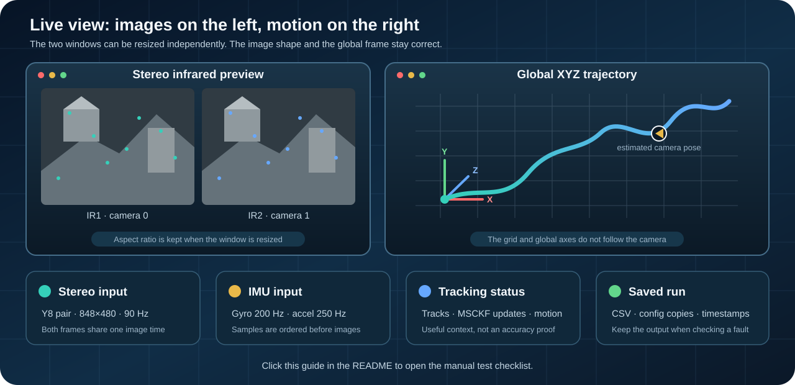

# D435i OpenVINS Standalone

<p align="center">
  <a href="#project-status"></a>
  <a href="LICENSE"></a>
  <a href="CHANGELOG.md"></a>
  <a href="https://isocpp.org/"></a>
  <a href="https://cmake.org/"></a>
  <a href="https://ubuntu.com/"></a>
</p>

<p align="center">
  <a href="https://github.com/realsenseai/librealsense"></a>
  <a href="https://docs.openvins.com/"></a>
  <a href="https://opencv.org/"></a>
  <a href="docs/dependencies.md"></a>
</p>

<p align="center">
  
</p>

This project runs stereo visual-inertial odometry on an Intel RealSense D435i
without ROS. It reads the two infrared cameras and the built-in IMU, sends the
measurements to OpenVINS, and saves the estimated pose, velocity, bias, timing,
and camera information.

It includes tools for live viewing, recording a dataset, replaying a dataset,
checking a camera, and reviewing the saved results.

> [!IMPORTANT]
> The reviewed v0.5.2 runtime remains odometry only. The v0.6.0 research branch
> adds offline, markerless SLAM evaluation without changing that live estimator
> path. It also provides a separate experimental pure ORB-SLAM3 desktop live
> executable; this is not OpenVINS/ORB fusion, and mapping, loop closure, and
> relocalization are not yet accepted production features.

## Project status

| Item | Current setup |
| --- | --- |
| Version | v0.6.0 research branch |
| Stable baseline | v0.5.2 OpenVINS odometry |
| Status | Offline SLAM benchmark foundation |
| Host | Ubuntu 22.04 or 24.04 |
| Camera | Intel RealSense D435i |
| Live stereo | 848×480 Y8 at 90 Hz |
| IMU | Gyroscope at 200 Hz, accelerometer at 250 Hz |
| Estimator | OpenVINS v2.7, built with ROS disabled |
| Language | C++17 |
| License | GNU GPLv3 |

The selected camera setup belongs to D435i serial `843212070146`:

```text
config/local/d435i-843212070146/selected_runtime/estimator.yaml
```

That setup is still marked `BOOTSTRAP_UNVERIFIED`. It is suitable for testing
and comparison, but it is not a certified accuracy profile. Tests with the
physical camera found an RSUSB gyro-sensitivity encoding error in the pinned
librealsense source. The supported build applies a reviewed host-side patch and
keeps the runtime gyro scale at `1.0`. Marked-position tests still showed some
endpoint drift, especially in poor light. See
[the selected runtime notes](docs/selected_runtime.md) for the measurements
and the limits of the current 90 Hz setup.

The next phase compares the same recordings with OpenVINS, ORB-SLAM3, and
OKVIS2 before choosing a mapping backend. The plan, metrics, frame separation,
and acceptance gates are in the
[markerless VSLAM research plan](docs/vislam_research_plan.md).

## How it works

<p align="center">
  <a href="docs/architecture.md">
    
  </a>
</p>

The RealSense callback copies each Y8 image once and places it in a bounded
queue. Accelerometer samples are rotated into the gyroscope frame and
interpolated at gyroscope timestamps. One ordered dispatcher sends the
synchronized IMU samples and stereo pairs to OpenVINS.

The program stops with an error if it sees a queue overflow, a timestamp going
backwards, a malformed frame, a calibration mismatch, a non-finite state, an
estimated speed above the safety limit, or an accelerometer bias above the
configured limit.

## Live viewer

<p align="center">
  <a href="docs/manual_test.md">
    
  </a>
</p>

The image window shows both infrared cameras without stretching their aspect
ratio. The trajectory window keeps the grid and global XYZ axes fixed while
the estimated camera pose moves through the scene. Click the picture above to
open the manual test guide.

<details>
<summary><strong>Viewer controls</strong></summary>

- Left-drag: orbit around the global frame.
- Middle/right-drag: pan.
- Mouse wheel: zoom around the pointer.
- `F`: fit the recorded path in the window.
- `R`, `0`, or double-left-click: reset the view.
- `q` or Escape: close the viewer cleanly.

</details>

The health label describes recent feature tracking. It does not prove that the
estimated position is correct.

## Build

Install the supported Ubuntu packages, build the project, and run the tests:

```bash
./scripts/install_ubuntu_dependencies.sh
./scripts/build_ubuntu.sh
./scripts/preflight_ubuntu.sh
```

Run the full test set again:

```bash
ctest --test-dir build/linux-release \
  --output-on-failure \
  --no-tests=error
```

For the C++ core and command-line stubs without camera or OpenVINS support:

```bash
cmake --preset portable-core
cmake --build --preset portable-core
ctest --preset portable-core --output-on-failure
```

The portable build checks only the portable code. It does not test
librealsense, OpenVINS, or a physical D435i.

The full Ubuntu build always uses the pinned, repository-local librealsense
with the reviewed RSUSB gyro patch. A same-version library under `/usr/local`
or another system path is deliberately ignored. Dependency patch hashes are
pinned in `cmake/DependencyVersions.cmake`; the registered repository test
runs the selected-runtime verifier and rejects a stream scale other than
`1.0`.

## Run the live viewer

Connect the selected D435i directly to USB 3 and run this from the repository
root in a graphical Ubuntu session:

```bash
(
  set -euo pipefail

  D435I_SERIAL="843212070146"
  SELECTED_DIR="config/local/d435i-${D435I_SERIAL}/selected_runtime"
  ESTIMATOR_CONFIG="${SELECTED_DIR}/estimator.yaml"
  STREAM_CONFIG="config/sensors/realsense_streams_vio_90hz.yaml"
  RUN_ID="$(date -u +%Y%m%dT%H%M%SZ)"
  LIVE_RUN="runs/live_diagnostic_${RUN_ID}"

  ./scripts/verify_selected_runtime.sh --serial "${D435I_SERIAL}"
  ./scripts/preflight_ubuntu.sh --require-build
  ./scripts/preflight_ubuntu.sh \
    --require-camera \
    --serial "${D435I_SERIAL}" \
    --stream-config "${STREAM_CONFIG}"

  ./build/linux-release/ovrs_live \
    --config "${ESTIMATOR_CONFIG}" \
    --stream-config "${STREAM_CONFIG}" \
    --serial "${D435I_SERIAL}" \
    --viewer \
    --viewer-history 5000 \
    --allow-unverified-calibration \
    --online-time-offset off \
    --output "${LIVE_RUN}"

  test ! -e "${LIVE_RUN}/INCOMPLETE"
  printf 'Completed live run: %s\n' "${LIVE_RUN}"
)
```

Keep the camera still while the estimator starts. Use a bright room with
static objects and clear texture visible in both infrared images. Stop the run
and keep its output if the estimated movement is clearly different from the
physical movement.

## Programs

| Program | Purpose |
| --- | --- |
| `ovrs_inspect` | Check the connected camera and its stream profiles |
| `ovrs_record` | Record synchronized stereo and IMU data |
| `ovrs_replay` | Run a saved dataset through the estimator |
| `ovrs_live` | Run the camera, estimator, logger, and optional viewer |
| `ovrs_orbslam3_live` | Run the separate experimental pure ORB-SLAM3 stereo-inertial viewer |
| `run_orbslam3_live.sh` | Safely prepare, launch, retain, and independently evaluate one live ORB-SLAM3 attempt |
| `export_vislam_benchmark.py` | Export a validated recording for offline SLAM comparison |
| `prepare_orbslam3_benchmark.py` | Apply the ORB-SLAM3 time, frame, calibration, and optional atlas adapter |
| `run_orbslam3_benchmark.py` | Run the pinned backend, enforce tracking gates, and record provisional atlas provenance |
| `evaluate_orbslam3_run.py` | Write a hashed tracking and loop-result manifest |
| `evaluate_orbslam3_live_run.py` | Independently recompute the pure ORB live continuity and optional return-to-start gates |

Each completed run stores configuration copies and CSV files under its output
directory. The files include raw device timestamps so timing problems can be
checked later.

The pinned ORB-SLAM3 build and current controlled results are documented in
the [offline ORB-SLAM3 baseline](docs/orbslam3_offline.md). Two identical runs
now initialize and track one sequence without an IMU-map reset. Loop correction
has not yet passed the repeatability or independent-reference gates.
The same offline guide documents the guarded atlas save/load and cross-session
map-merge protocol. A patched atlas now survives reload and completes a merge
on offline playback of a recorded D435i sequence. Loading now requires the
companion atlas manifest and rejects a serial, calibration, cadence, backend,
library, or vocabulary mismatch before promotion. A distinct revisit and an
independent false-merge/pose reference are still required.
The first isolated desktop live integration is documented in
[the ORB-SLAM3 live guide](docs/orbslam3_live.md). It preserves `ovrs_live` as
the OpenVINS baseline and does not claim hybrid fusion. The canonical ORB
trajectory is fail-closed: pre-initialization visual tracking is diagnostic,
acceptance starts only after inertial BA2 and continuously valid tracking are
stable, and an active-map reset, post-acceptance tracking loss or frame gap,
inertial-state regression, or later global map correction prevents publication
of a continuous accepted trajectory. The maximum frame interval is derived
from the pinned nominal ORB rate rather than hidden in the executable. A
stationary camera still refreshes the native Current Frame IR viewer while it
reports `TRYING TO INITIALIZE`; this viewer availability does not imply an
accepted pose or inertial initialization. A
separate evaluator cross-checks the raw tracking/IMU logs, canonical
trajectory, hardware serial, bundle, backend patch, and shared-library
provenance. Its optional rigid-stop return reference is evaluation-only and is
never consumed by ORB-SLAM3, OpenVINS, or an EKF. Live return evaluation uses
predeclared multi-sample start/end hold windows and rejects insufficient or
dispersed endpoint evidence rather than trusting one first/last pose pair.
New runs also bind the running executable, vocabulary, settings, bundle, and
actual backend library at process start; older evidence remains explicitly
labelled as lacking capture-time executable attestation.

## Repository layout

```text
apps/                 command-line programs
include/ovrs/, src/   capture, synchronization, estimator adapter, and logging
config/               stream and estimator settings
docs/                 guides, design notes, and test records
patches/              reviewed changes for pinned third-party dependencies
scripts/              build, validation, calibration, and plotting tools
tests/                unit tests, synthetic replay tests, and repository checks
third_party/open_vins pinned OpenVINS submodule
```

## Documentation

- [Operator and calibration runbook](docs/operator_runbook.md)
- [Manual test checklist](docs/manual_test.md)
- [Selected runtime and test results](docs/selected_runtime.md)
- [Markerless VSLAM research plan](docs/vislam_research_plan.md)
- [Architecture](docs/architecture.md)
- [Mathematical background](docs/mathematical_foundation.md)
- [Calibration guide](docs/calibration.md)
- [Dataset format](docs/dataset.md)
- [Timestamp handling](docs/timestamps.md)
- [Dependencies](docs/dependencies.md)
- [Audit summary](AUDIT_REPORT.md)
- [Change history](CHANGELOG.md)
- [Third-party notices](THIRD_PARTY_NOTICES.md)

## Scope and safety

- Do not promote a calibration by changing only its state label.
- Do not write calibration or firmware to the camera EEPROM from this project.
- Do not mix recordings from different cameras or stream settings.
- Do not report a hardware test as passed unless a D435i was connected.
- Keep the OpenVINS submodule pinned and rebuild it after changing its patch.

This branch permits offline markerless mapping, loop-closure, and
relocalization research. It does not include ROS, ROS2, MAVLink, ArduPilot,
Pixhawk, GPS, navigation, depth processing, RGB processing, simulation, or
flight control. It does not send poses to a flight controller.

## A small way to help

<p align="center">
  <a href="https://github.com/gedxxe/D435i-OpenVINS">
    
  </a>
</p>

If this project saves you some debugging time, consider giving it a star. It
helps other D435i and OpenVINS users find the repository. Reproducible issue
reports and test notes are welcome too.

## Author

I Gede Bagus Jayendra

## License

This project is licensed under the
[GNU General Public License version 3](LICENSE). Third-party components keep
their own copyright and license terms; see
[THIRD_PARTY_NOTICES.md](THIRD_PARTY_NOTICES.md).
