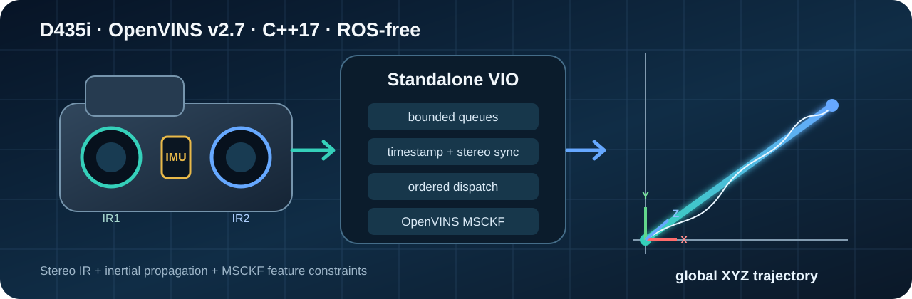
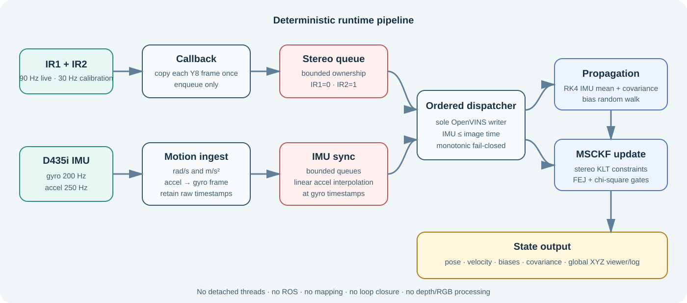
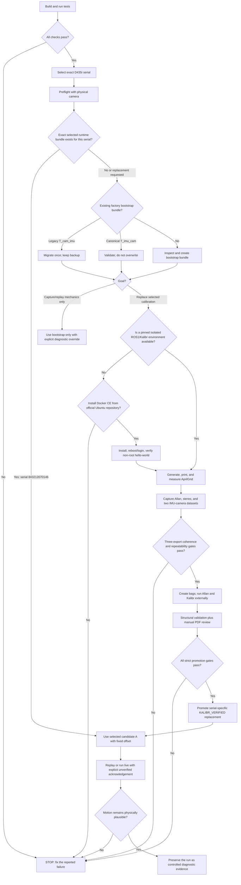

# Complete operator and calibration runbook

This is the long-form, copy-pasteable workflow. For project scope, build
commands, and normal live startup, begin with the concise
[repository README](../README.md). The procedure remains intentionally
detailed because each calibration and promotion gate has explicit stop
conditions.

<p align="center">
  
</p>

<p align="center">
  <strong>Deterministic, ROS-free stereo visual-inertial odometry for one Intel RealSense D435i.</strong><br>
  IR1 + IR2 + gyroscope + accelerometer → OpenVINS v2.7 → real-time global XYZ trajectory.
</p>

> [!IMPORTANT]
> This is odometry, not mapping or loop closure. Drift is bounded by sensor
> quality, calibration, excitation, feature geometry, and estimator
> consistency. The selected camera records an explicit gyro-scale policy.
> The patched RSUSB host path now preserves the requested gyro sensitivity and
> uses the SDK value directly at scale `1.0`; this removes the demonstrated
> angular-scale mismatch but cannot eliminate standalone-VIO drift.

## At a glance

| Property | Project contract |
|---|---|
| Runtime | C++17, Ubuntu 22.04/24.04, no ROS |
| Sensors used | Stereo Y8 IR1/IR2, 3-axis gyro, 3-axis accelerometer |
| Default calibration streams | 848×480 @ 30 Hz, gyro 200 Hz, accelerometer 250 Hz |
| Selected VIO streams | 848×480 @ 90 Hz, gyro 200 Hz, accelerometer 250 Hz, sensitivity 1, gyro scale 1.0 |
| Estimator | OpenVINS v2.7 MSCKF, FEJ enabled, RK4 propagation |
| Concurrency | bounded queues, deterministic ownership, no detached threads |
| Output | pose, velocity, biases, covariance, visual-support status, trajectory log, interactive global XYZ viewer |
| Calibration | serial-specific camera, stereo, camera-IMU, time offset, IMU noise/intrinsics |
| Explicitly excluded | RGB/depth processing, ROS/ROS2, mapping, loop closure, GPS, navigation, flight control |

The runtime is standalone, while the supported offline calibration procedure
uses pinned Allan/Kalibr tools in an isolated Ubuntu 20.04/ROS1 container.
Those tools are not runtime dependencies. See [CHANGELOG.md](../CHANGELOG.md) for
release history and [AUDIT_REPORT.md](../AUDIT_REPORT.md) for the engineering
audit.

## Experimental runtime for the selected camera

> [!WARNING]
> The selected bundle for D435i serial `843212070146` is not accepted as a
> drift-safe runtime. A pinned librealsense RSUSB encoding bug made some
> level-1 sessions report about twice the visual rotation. The supported build
> now patches that host-side bug and keeps project gyro scale `1.0`, but a
> controlled live run still retained material endpoint drift. Use the command
> below only to record diagnostic evidence, keep the 3 m/s safety gate enabled,
> and do not use its pose as a trusted measurement.

The current diagnostic baseline is:

```text
config/local/d435i-843212070146/selected_runtime/estimator.yaml
```

It uses the repeatable candidate-A camera/IMU calibration, fixed
-4.900203074 ms camera-IMU offset, post-calibration gyro scale `1.0`, and
visually gated stop recovery. Identical-data replay and connected live testing
remove the earlier runaway, but operator-bounded live motion still shows
residual position drift.

The verifier rejects any selected stream that no longer contains sensitivity
level 1 and gyro scale 1.0. Patch hashes are pinned beside dependency commits,
and the full build rejects a changed patch or system librealsense before
starting the estimator.

Start the realtime stereo and interactive global XYZ diagnostic viewer from a
graphical Ubuntu session:

```bash
(
  set -euo pipefail

  D435I_SERIAL="843212070146"
  SELECTED_DIR="config/local/d435i-${D435I_SERIAL}/selected_runtime"
  ESTIMATOR_CONFIG="${SELECTED_DIR}/estimator.yaml"
  STREAM_CONFIG="config/sensors/realsense_streams_vio_90hz.yaml"
  RUN_ID="$(date -u +%Y%m%dT%H%M%SZ)"
  LIVE_RUN="runs/live_diagnostic_${RUN_ID}"

  ./scripts/verify_selected_runtime.sh

  ./scripts/preflight_ubuntu.sh --require-build
  ./scripts/preflight_ubuntu.sh \
    --require-camera \
    --serial "${D435I_SERIAL}" \
    --stream-config "${STREAM_CONFIG}"

  ./build/linux-release/ovrs_live \
    --config "${ESTIMATOR_CONFIG}" \
    --stream-config "${STREAM_CONFIG}" \
    --serial "${D435I_SERIAL}" \
    --viewer \
    --viewer-history 5000 \
    --allow-unverified-calibration \
    --online-time-offset off \
    --output "${LIVE_RUN}"

  test ! -e "${LIVE_RUN}/INCOMPLETE"
  printf 'Completed live run: %s\n' "${LIVE_RUN}"
)
```

Mount or hold the D435i rigidly, connect it directly to a stable USB 3 port,
and keep sharp, non-repeating, static texture visible in both infrared images.
Keep it still until `initialized` appears and for several seconds afterward.
Preserve any run where estimated motion disagrees with physical motion.

The trajectory window is interactive:

- left-drag orbits the global XYZ view;
- middle/right-drag pans it;
- the mouse wheel zooms about the cursor;
- `F` fits the current track without changing the viewing direction;
- `R`, `0`, or double-left-click restores the default isometric view;
- `q` or Escape performs a clean shutdown.

The grid and global axes stay fixed until `F` is pressed; new states no longer
silently re-centre or rescale the world. The window is freely resizable and
uses a compact axis triad plus start/current markers, XYZ span, path length,
and displacement. This remains an estimator view, not RViz and not external
ground truth.

Stop and preserve the run if estimated displacement disagrees materially with
physical motion. The selected VIO stream uses 848x480 Y8 stereo at 90 Hz and
explicitly sets then reads back D435i gyro-sensitivity level `1`. It also
records and applies `gyro_scale_factor: 1.0`. The build applies the reviewed
RSUSB gyro-sensitivity patch and verifies that the hardware executables load
the repository-local library. A patched connected capture measured
visual/gyro rotations of 5.010/5.052, 13.497/13.287, and 12.078/12.076
degrees. This fixes the acquisition-scale runaway, but an earlier connected
131-second run retained approximately 0.62 m endpoint error beyond reported
physical translation. Keep the separate 30 Hz
`config/sensors/realsense_streams.yaml` profile for documented calibration
captures; it carries the same sensitivity and scale contract. Historical
`0.5` evidence remains documented rather than silently reinterpreted.

The explicit `--allow-unverified-calibration` flag is still required. The
bundle has repeat Kalibr and connected-camera evidence, but the small target
and pre-device-update Allan-noise provenance prevent an honest
`KALIBR_VERIFIED` label. The selected bundle is a reproducible diagnostic
baseline, not an accuracy-certified runtime. The evidence, rejected
alternatives, and replacement rule are recorded in
[the selected runtime contract](selected_runtime.md).

Use the long calibration runbook below only when this exact local bundle is
missing, the physical camera serial changes, the stream policy changes, or a
new calibration is being evaluated to replace it.

## Reproduce or falsify the current diagnostic baseline

Do not accept a run by looking only for `healthy=1`, a completed replay, or a
flat final velocity. Use one controlled capture so the exact measurements can
be replayed:

The project-owned gate reports visual support as `WARMING_UP`, `HEALTHY`, or
`DEGRADED` plus the current feature count. Here `HEALTHY` means only that the
configured support threshold has been sustained. It catches prolonged loss of
accepted visual constraints; it does not certify pose accuracy.

1. Verify the six SHA-256 values and pass both preflight commands in the
   ready-to-run block above. Do not substitute another serial, calibration,
   stream file, gyro-sensitivity/scale policy, online time-offset policy, or
   stop-recovery setting.
2. Mark one camera pose on a rigid surface. Record 120 seconds with
   `--capture-mode vio`: 0-20 seconds still, 20-50 seconds smooth outbound
   translation and rotation, 50-65 seconds smooth return to the marked pose,
   and 65-120 seconds still. Keep sharp static texture visible in IR1 and IR2
   throughout.
3. Validate that the dataset is complete and has zero capture integrity
   errors. Its `device_report.yaml` must report sensitivity available with
   requested and active values both equal to `1`, and gyro scale configured
   and applied values both equal to `1`. Replay it with the selected
   estimator, `--allow-unverified-calibration`, and
   `--online-time-offset off`.
4. Before inspecting the result, declare limits based on the physical path:
   maximum plausible path length and maximum final displacement. Check them
   with `scripts/plot_trajectory.py`; the software cannot infer placement
   error at the marked pose.
5. Only after replay passes those physical limits, run live with the exact
   command above and repeat the same motion. Preserve the dataset and run
   directories whenever a bound fails.

The exact record, replay, and bounded-analysis commands are in
[Step 12](#12-record-replay-and-run-the-selected-estimator). The corrected
hardware capture retained 5388 stereo pairs and 11982 synchronized IMU rows
with every transport-integrity counter at zero. The historical selected replay
completed 57.83 seconds and ended at 0.0033 m/s, but it had already accumulated
60.893 m of estimated path and 10.677 m of final displacement. Later live runs
also reached 4.147 m displacement in 29.11 seconds and approached the 3 m/s
safety gate with zero transport errors. Stop recovery therefore demonstrated
only a final velocity constraint, not a drift fix. See
[selected_runtime.md](selected_runtime.md).

## Runtime architecture

<p align="center">
  
</p>

The RealSense callback owns one bounded copy of each Y8 frame and only
enqueues measurements. Accelerometer samples are rotated into the gyro stream
frame and linearly interpolated at gyro timestamps. The ordered dispatcher is
the sole owner of OpenVINS ingestion: it sends all IMU samples up to an image
timestamp before sending that stereo pair.

This separation matters. Camera callbacks must not block on estimation, and
multiple threads must not race to mutate the filter state. Queue overflow,
regressing timestamps, malformed frames, and calibration mismatches are
reported or rejected rather than silently repaired.

## Mathematical foundation

The equations below summarize the contract implemented by this repository;
they are not a replacement for the complete
[OpenVINS derivations](https://docs.openvins.com/pages.html).

### 1. IMU measurement and propagation

Let ${}^{G}\!R_I$ rotate an IMU-frame vector into the global frame. With
gyroscope bias $b_g$, accelerometer bias $b_a$, white measurement noises
$n_g,n_a$, and global gravity ${}^{G}\!g$, the basic calibrated IMU model is

$$
\omega_m = \omega + b_g + n_g,
\qquad
a_m = {}^{I}\!R_G\left({}^{G}\!a_I-{}^{G}\!g\right)+b_a+n_a.
$$

The continuous navigation state evolves as

$$
\dot{{}^{G}\!R_I}
  = {}^{G}\!R_I[\omega_m-b_g-n_g]_\times,
\qquad
\dot{{}^{G}\!p_I} = {}^{G}\!v_I,
$$

$$
\dot{{}^{G}\!v_I}
  = {}^{G}\!R_I(a_m-b_a-n_a)+{}^{G}\!g,
\qquad
\dot b_g=n_{wg},\quad \dot b_a=n_{wa}.
$$

Here $[\cdot]_\times$ is the skew-symmetric cross-product matrix, while
$n_{wg}$ and $n_{wa}$ drive bias random walks. The default runtime uses
OpenVINS RK4 mean propagation and covariance propagation over the 15-element
IMU error state: orientation, position, velocity, gyro bias, and accelerometer
bias.

The fuller OpenVINS intrinsic model additionally admits invertible scale/
cross-axis matrices $T_w,T_a$, sensor-frame rotations, and gyro
gravity-sensitivity $T_g$. A stationary Allan recording estimates stochastic
noise terms; it cannot identify all those deterministic intrinsic matrices
from one orientation. OpenVINS likewise warns that intrinsic calibration needs
well-excited motion to avoid degeneracy.

### 2. D435i sampling and time alignment

Librealsense supplies motion values in rad/s and m/s². The generic
`StreamConfig` default preserves SDK gyro rad/s with scale `1.0`; the selected
serial now explicitly uses the post-calibration selected factor $s_g=1.0$:

$$
\omega_{\mathrm{used}}=s_g\,\omega_{\mathrm{SDK}}.
$$

The accelerometer measurement is rotated with the device-reported
accel-to-gyro rotation:

$$
a_{\mathrm{gyro}}^{\text{sample}}
=R_{\mathrm{gyro}\leftarrow\mathrm{accel}}\,
 a_{\mathrm{accel}}^{\text{sample}}.
$$

Because the configured accelerometer and gyro rates differ, acceleration at a
gyro timestamp $t_g\in[t_{a0},t_{a1}]$ is

$$
\alpha=\frac{t_g-t_{a0}}{t_{a1}-t_{a0}},
\qquad
a(t_g)=(1-\alpha)a(t_{a0})+\alpha a(t_{a1}).
$$

Raw device timestamps remain beside normalized seconds so synchronization can
be audited. The runtime requires the exact configured motion profiles instead
of silently substituting the nearest available rates.

### 3. Stereo geometry and why disparity matters

For a rectified pinhole stereo pair with focal length $f_x$, baseline $b$,
and disparity $d=u_L-u_R$, approximate depth is

$$
Z \approx \frac{f_x b}{d}.
$$

First-order uncertainty therefore grows approximately as

$$
\sigma_Z \approx \frac{Z^2}{f_x b}\,\sigma_d.
$$

The D435i's short stereo baseline means distant, low-disparity features have
weak depth conditioning. Fast blur, repeated texture, poor exposure, bad
intrinsics, or a wrong stereo transform can then damage the visual constraint
even if the IMU stream is numerically smooth.

The runtime transform key is `T_imu_cam`, which maps a homogeneous point from
camera coordinates into IMU coordinates:

$$
\begin{bmatrix}p_I\\1\end{bmatrix}
=T_{\mathrm{imu}\leftarrow\mathrm{cam}}
\begin{bmatrix}p_C\\1\end{bmatrix}.
$$

Kalibr's opposite-direction output is inverted only at the reviewed promotion
boundary.

### 4. MSCKF visual constraint

For a tracked feature, the linearized pixel residual over its observations is

$$
r \approx H_x\tilde x + H_f\tilde p_f+n.
$$

MSCKF does not need to retain that feature as a permanent map landmark.
Instead, it finds a left-nullspace basis $N$ satisfying
$N^\mathsf{T}H_f=0$, then projects

$$
r_o=N^\mathsf{T}r
\approx N^\mathsf{T}H_x\tilde x+N^\mathsf{T}n.
$$

The resulting constraint updates the navigation state while eliminating the
unknown feature error. For $H=N^\mathsf{T}H_x$ and projected noise
covariance $R$, the EKF update follows

$$
S=HPH^\mathsf{T}+R,\qquad
K=PH^\mathsf{T}S^{-1},
$$

$$
\delta x=Kr_o,\qquad
P^+=(I-KH)P^-.
$$

The project keeps OpenVINS First-Estimate Jacobians enabled to preserve the
intended observability/consistency behavior.

### 5. ZUPT and fail-closed stationarity

The local OpenVINS patch adds the missing velocity observation only after
inertial and visual stationarity agree. For a zero-velocity residual,

$$
r_v=0-\hat v_I,\qquad H_v=
\begin{bmatrix}0&0&I_3&0&0\end{bmatrix}.
$$

Low feature disparity is an additional gate. Missing visual tracks mean
“unknown,” not “stationary.” The serial-specific selected runtime permits
post-motion recovery only after one second of consecutive frames with more
than 20 common tracks and mean disparity below 2 px; any moving or unknown
frame resets the candidate. The generic estimator template remains more
conservative.

### 6. IMU noise parameters

For sample interval $\Delta t$, a continuous white-noise density
$\sigma_n$ maps approximately to per-sample standard deviation
$\sigma_n/\sqrt{\Delta t}$, while bias random-walk increments scale as
$\sigma_w\sqrt{\Delta t}$ under the convention used by the calibration
tool. Recording longer extends the Allan time scales available to fitting; it
does not correct wrong units, axes, timestamps, motion contamination, or a bad
fit.

Primary references:

- [OpenVINS IMU propagation derivations](https://docs.openvins.com/propagation.html)
- [OpenVINS camera measurement model](https://docs.openvins.com/update-feat.html)
- [OpenVINS MSCKF nullspace projection](https://docs.openvins.com/update-null.html)
- [OpenVINS zero-velocity update](https://docs.openvins.com/update-zerovelocity.html)
- [Librealsense D400 IMU coordinate system](https://github.com/IntelRealSense/librealsense/blob/master/doc/rs400/rs400_imu_coordinates.md)

## Repository layout

```text
apps/                 inspector, recorder, live runner, dataset replay
include/ovrs/, src/   synchronization, dispatch, capture, adapter, viewer
config/               stream templates and estimator configuration
patches/              reviewed changes for pinned third-party dependencies
third_party/open_vins pinned v2.7 Git submodule; ROS disabled
scripts/              dependency, build, validation, run, and plotting tools
tests/                dependency-light unit and synthetic replay tests
docs/                 architecture, timing, calibration, and manual contracts
```

## Operator runbook

Run all commands below from the repository root on Ubuntu 24.04. Shell blocks
are Bash, not Python. Keep the same terminal open while a capture session is in
progress, because later state gates deliberately depend on the variables
created earlier.

For serial `843212070146`, the ready-to-run section above is the primary
operator path. Steps 1-12 below document how to rebuild, replace, or reproduce
that selection. They are not prerequisites for every normal startup.

### Decision flow



`STOP` means do not continue with a later command merely because the camera is
detected or a file exists.

## Safety and naming rules

- Never run the four `ovrs_*` applications with `sudo`.
- Never flash firmware or write camera EEPROM from this repository.
- Never patch the kernel, disable Secure Boot, or install ROS on the runtime
  host for this procedure.
- Never reuse calibration from another serial, resolution, stream rate, or IMU
  motion-correction policy.
- For serial `843212070146`, do not substitute the factory bootstrap,
  candidate B, an online-offset result, or a continuous-ZUPT trial for the
  selected candidate A runtime.
- Never treat `BOOTSTRAP_UNVERIFIED`, `UNVERIFIED_CAPTURE`, `INCOMPLETE`, or an
  unchecked Kalibr report as verified.
- `ovrs_replay` gets the camera serial from dataset metadata. It intentionally
  has no `--serial` option.
- Executables are not installed on `PATH`. Use
  `./build/linux-release/ovrs_*`.

## 1. Install prerequisites, build, and test

Run the read-only preflight first:

```bash
./scripts/preflight_ubuntu.sh
```

If it reports missing reviewed Ubuntu packages:

```bash
./scripts/install_ubuntu_dependencies.sh
```

Then build and test:

```bash
(
set -euo pipefail
./scripts/build_ubuntu.sh
./scripts/preflight_ubuntu.sh --require-build
ctest --test-dir build/linux-release \
  --output-on-failure --no-tests=error
)
```

Success requires project version 0.5.2, OpenVINS v2.7 with ROS disabled,
repository-local Ceres 2.1.0, patched repository-local librealsense 2.57.3,
hardware executables resolving that local library, and actual CTest cases.
`No tests were found` is a failure.

## 2. Start one terminal session

Paste this Bash block directly into the terminal:

```bash
while :; do
  read -r -p "Enter the numeric D435i serial: " D435I_SERIAL
  case "${D435I_SERIAL}" in
    ''|*[!0-9]*)
      echo "The D435i serial must contain digits only." >&2
      ;;
    *)
      break
      ;;
  esac
done

D435I_RUN_ID="$(date -u +%Y%m%dT%H%M%SZ)"
export D435I_SERIAL D435I_RUN_ID
printf 'Camera serial: %s\nRun ID: %s\n' \
  "${D435I_SERIAL}" "${D435I_RUN_ID}"
mkdir -p output datasets runs calibration
```

`D435I_SERIAL` selects one physical unit. `D435I_RUN_ID` prevents accidental
overwrite. If the terminal closes, repeat this section and start a new attempt.

## 3. Connect and sample the exact camera

Connect the D435i directly to a known-good USB 3 port:

```bash
./scripts/preflight_ubuntu.sh \
  --require-camera \
  --serial "${D435I_SERIAL}" \
  --stream-config config/sensors/realsense_streams.yaml
```

Continue only if the exact serial opens, one-second stereo/IMU sampling
completes, timestamp checks pass, and the result is `PASS` or an understood
`PASS_WITH_WARNINGS`.

If the camera enumerates and stereo works but both IMU rates remain zero, stop
before calibration. Follow the conservative
[Ubuntu 24.04 kernel 6.8 D435i IMU recovery runbook](ubuntu_24_04_kernel_6_8_d435i.md);
it keeps the current kernel as a rollback boot and includes explicit failure
plans. Do not patch the kernel, disable Secure Boot, or change camera firmware
to bypass this gate.

## 4. Create the optional Python environment

The C++ runtime does not need Python. Calibration validation, migration, and
plotting use a repository-local environment:

```bash
python3 -m venv .venv
.venv/bin/python -m pip install --requirement requirements.txt
```

Do not use `sudo pip`, global `pip`, or modify system Python.

## 5. Repair or create the local bootstrap bundle

Skip this step during normal operation of selected serial `843212070146`.
Its factory bootstrap is historical diagnostic evidence, not the active
estimator. Run this step only for a different camera or to reconstruct the
calibration workflow from the beginning.

First inspect an existing bundle:

```bash
BUNDLE="config/local/d435i-${D435I_SERIAL}"
CAMERA_YAML="${BUNDLE}/d435i_factory_imucam.yaml"

if test -f "${CAMERA_YAML}"; then
  grep -E 'T_(cam_imu|imu_cam)' "${CAMERA_YAML}"
else
  echo "No existing local bundle."
fi
```

Apply exactly one branch.

### Branch A: the existing file contains `T_cam_imu`

This is the legacy, ambiguous project contract. Pinned OpenVINS can read and
invert it, but the repository now permits only one explicit runtime direction.
Migrate it once:

```bash
.venv/bin/python scripts/migrate_openvins_transform_v050.py \
  --bundle "${BUNDLE}" \
  --acknowledge-transform-direction
```

The script verifies the serial/state, validates both rigid transforms, computes
their exact inverses, writes `T_imu_cam`, and retains
`d435i_factory_imucam.pre-v0.5.0.yaml`. It refuses a second migration.

### Branch B: the existing file contains `T_imu_cam`

Do not overwrite it. Confirm that it has two transforms:

```bash
test "$(grep -c '^[[:space:]]*T_imu_cam:' "${CAMERA_YAML}")" -eq 2
test "$(grep -c '^[[:space:]]*T_cam_imu:' "${CAMERA_YAML}")" -eq 0
```

### Branch C: no local bundle exists

Export factory data:

```bash
FACTORY_EXPORT="output/factory_${D435I_SERIAL}_${D435I_RUN_ID}.yaml"

./build/linux-release/ovrs_inspect \
  --duration 10 \
  --serial "${D435I_SERIAL}" \
  --stream-config config/sensors/realsense_streams.yaml \
  --export "output/device_${D435I_SERIAL}_${D435I_RUN_ID}.yaml" \
  --export-calibration "${FACTORY_EXPORT}"

bash scripts/prepare_bootstrap_config.sh \
  --calibration "${FACTORY_EXPORT}" \
  --expected-serial "${D435I_SERIAL}" \
  --stream-config config/sensors/realsense_streams.yaml \
  --validate-only
```

Review serial, resolution, intrinsics, distortion mapping, two `T_imu_cam`
matrices, nonzero stereo baseline, and the factory zero time-offset assumption.
Then create the non-overwriting local bundle:

```bash
bash scripts/prepare_bootstrap_config.sh \
  --calibration "${FACTORY_EXPORT}" \
  --expected-serial "${D435I_SERIAL}" \
  --stream-config config/sensors/realsense_streams.yaml \
  --acknowledge-reviewed-factory-export
```

This bundle remains `BOOTSTRAP_UNVERIFIED`. It is useful for mechanical
diagnostics, not for declaring estimator accuracy.

## 6. Optional mechanical smoke test

Skip this section if the goal is proper calibration. The override is explicit
because the result is not trustworthy VIO evidence.

This is not the runtime test for selected serial `843212070146`; use the
ready-to-run candidate A command at the top of this runbook instead.

```bash
SMOKE_DATASET="datasets/smoke_${D435I_RUN_ID}"
SMOKE_RUN="runs/smoke_replay_${D435I_RUN_ID}"

./build/linux-release/ovrs_record \
  --capture-mode vio \
  --serial "${D435I_SERIAL}" \
  --duration 15 \
  --stream-config config/sensors/realsense_streams.yaml \
  --output "${SMOKE_DATASET}"

./build/linux-release/ovrs_replay \
  --dataset "${SMOKE_DATASET}" \
  --config "${BUNDLE}/bootstrap.yaml" \
  --rate 1 \
  --viewer \
  --allow-unverified-calibration \
  --output "${SMOKE_RUN}"
```

This checks capture, replay, and viewer mechanics only. Do not tune the
estimator against this output.

## 7. Generate, print, and measure one AprilGrid

Here, **board** always means the printed AprilGrid sheet mounted flat on a
rigid white backing. It does not mean a checkerboard, computer display, wall,
or arbitrary object. The same physical board and its measured YAML must be
used for stereo and camera-IMU calibration.

Kalibr recommends AprilGrid because partial views can still be detected and
the target pose is unambiguous. It also requires a flat target, measurement
after printing, and a surrounding white border at least one grid element
wide. Hide all other AprilTags during capture.

Step 7 is complete only when all four statements are true:

- the PDF came from the repository-pinned Kalibr commit;
- the entire grid and white border fit on one unscaled printed page;
- the mounted board is flat and its tag edge/gap were physically measured;
- `TARGET_YAML` names that exact board and contains the measured dimensions.

Do not reuse a YAML from another print, even when both prints nominally use the
same row/column count. Printer scaling changes the physical target geometry.

### 7A. Plan a grid that fits the available paper

The official downloadable Kalibr board is A0 and must not be scaled to A4.
For an A4 printer, start with the visible, editable 6 by 6 profile below. The
18 mm tag is a starting print size, not a claimed post-print measurement.
Enter the non-printable margin from the printer manual or print dialog:

```bash
read -r -p "Printer non-printable margin on each edge in mm: " \
  PRINTER_MARGIN_MM

GRID_ROWS=6
GRID_COLS=6
NOMINAL_TAG_SIZE_MM=18
NOMINAL_SPACING_RATIO=0.3

.venv/bin/python scripts/plan_aprilgrid_target.py \
  --tag-rows "${GRID_ROWS}" \
  --tag-cols "${GRID_COLS}" \
  --tag-size-mm "${NOMINAL_TAG_SIZE_MM}" \
  --tag-spacing-ratio "${NOMINAL_SPACING_RATIO}" \
  --paper-width-mm 210 \
  --paper-height-mm 297 \
  --printer-margin-mm "${PRINTER_MARGIN_MM}"
```

Continue only on `fit_result: PASS`. This check includes the minimum white
border. If it fails, reduce the tag size and rerun; do not use printer
`Fit`, `Shrink`, or tiled-page scaling to force a fit.

### 7B. Generate the PDF with pinned Kalibr

`scripts/create_aprilgrid_target.py` creates YAML only; it deliberately does
not fabricate AprilTag images. The PDF must come from the pinned official
Kalibr generator. Choose one branch:

- If a supported Kalibr environment already exists, run the generator command
  printed by the planner there and copy the PDF into `calibration/`.
- If Docker is installed and `docker run --rm hello-world` succeeds without
  `sudo`, use the isolated Docker branch below.
- If neither is available, the existing Allan capture can still be checked and
  preserved, but stop before stereo/camera-IMU capture.

If `docker info` already succeeds without `sudo`, skip this installation
subsection. Otherwise Docker's current official Ubuntu instructions are:
<https://docs.docker.com/engine/install/ubuntu/>. They list Noble 24.04 as
supported. First inspect, but do not automatically remove, packages that can
conflict with Docker CE:

```bash
for package in \
  docker.io docker-compose docker-compose-v2 docker-doc podman-docker \
  containerd runc; do
  dpkg-query -W -f='${db:Status-Abbrev}\n' "${package}" 2>/dev/null |
    grep -q '^ii ' && printf 'REVIEW INSTALLED CONFLICT: %s\n' "${package}"
done
```

If that prints any package, stop and review Docker's “Uninstall old versions”
section before changing the host; existing containers or other software may
depend on it. If it prints nothing, install from Docker's signed `apt`
repository. This is an explicit host change and is never done by a repository
script:

```bash
(
  set -euo pipefail
  sudo apt-get update
  sudo apt-get install -y ca-certificates curl
  sudo install -m 0755 -d /etc/apt/keyrings
  sudo curl -fsSL https://download.docker.com/linux/ubuntu/gpg \
    -o /etc/apt/keyrings/docker.asc
  sudo chmod a+r /etc/apt/keyrings/docker.asc

  . /etc/os-release
  DOCKER_CODENAME="${UBUNTU_CODENAME:-${VERSION_CODENAME}}"
  DOCKER_ARCH="$(dpkg --print-architecture)"
  printf '%s\n' \
    'Types: deb' \
    'URIs: https://download.docker.com/linux/ubuntu' \
    "Suites: ${DOCKER_CODENAME}" \
    'Components: stable' \
    "Architectures: ${DOCKER_ARCH}" \
    'Signed-By: /etc/apt/keyrings/docker.asc' |
    sudo tee /etc/apt/sources.list.d/docker.sources >/dev/null

  sudo apt-get update
  sudo apt-get install -y \
    docker-ce docker-ce-cli containerd.io \
    docker-buildx-plugin docker-compose-plugin
  sudo systemctl is-active docker
  sudo docker run --rm hello-world
)
```

The final command must print Docker's `Hello from Docker!` message. The
calibration workflow must then run as the normal host user so generated files
are not owned by root. Docker documents a rootless mode, or the following
group-based option:

```bash
(
  set -euo pipefail
  getent group docker >/dev/null || sudo groupadd docker
  sudo usermod -aG docker "${USER}"
  printf '%s\n' \
    'Docker group membership is not active yet.' \
    'Reboot or log out and back in, then resume at runbook Step 2.'
)
```

The `docker` group grants root-level privileges; use it only if that security
decision is acceptable. After the new login, require both commands to succeed
without `sudo`:

```bash
(
  set -euo pipefail
  docker info >/dev/null
  docker run --rm hello-world
)
```

See Docker's official post-install page:
<https://docs.docker.com/engine/install/linux-postinstall/>. Do not prepend
`sudo` to later runbook Docker blocks, because it would create root-owned
calibration artifacts.

The Docker branch installs nothing into system Python or ROS on Ubuntu 24.04:

```bash
(
  set -euo pipefail
  KALIBR_COMMIT="$(
    sed -n 's/^set(OVRS_KALIBR_COMMIT "\([^"]*\)").*/\1/p' \
      cmake/DependencyVersions.cmake
  )"
  test "${#KALIBR_COMMIT}" -eq 40
  KALIBR_SOURCE=".deps/calibration/kalibr"
  KALIBR_IMAGE="ovrs-kalibr:${KALIBR_COMMIT:0:12}"

  command -v docker >/dev/null
  docker info >/dev/null

  if ! test -d "${KALIBR_SOURCE}/.git"; then
    git clone https://github.com/ethz-asl/kalibr.git "${KALIBR_SOURCE}"
  fi
  git -C "${KALIBR_SOURCE}" diff --quiet
  git -C "${KALIBR_SOURCE}" diff --cached --quiet
  git -C "${KALIBR_SOURCE}" fetch origin "${KALIBR_COMMIT}"
  git -C "${KALIBR_SOURCE}" checkout --detach "${KALIBR_COMMIT}"
  test "$(git -C "${KALIBR_SOURCE}" rev-parse HEAD)" = "${KALIBR_COMMIT}"

  docker build \
    --file "${KALIBR_SOURCE}/Dockerfile_ros1_20_04" \
    --tag "${KALIBR_IMAGE}" \
    "${KALIBR_SOURCE}"

  docker run --rm \
    --entrypoint /bin/bash \
    "${KALIBR_IMAGE}" \
    -lc 'set -e
         source /catkin_ws/devel/setup.bash
         for tool in \
           kalibr_create_target_pdf \
           kalibr_bagcreater \
           kalibr_calibrate_cameras \
           kalibr_calibrate_imu_camera; do
           rosrun kalibr "${tool}" --help >/dev/null
         done'
  printf 'Kalibr image: %s\n' "${KALIBR_IMAGE}"
)
```

The post-build smoke test is mandatory. Kalibr installs these Python tools as
ROS package executables under `lib/kalibr`; sourcing the catkin workspace does
not guarantee that their bare names are on `PATH`. This procedure therefore
invokes every tool through `rosrun kalibr`. Stop if any help check fails.

Generate the nominal PDF into the ignored `calibration/` work area:

```bash
(
  set -euo pipefail
  : "${GRID_COLS:?Run Step 7A first}"
  : "${GRID_ROWS:?Run Step 7A first}"
  : "${NOMINAL_TAG_SIZE_MM:?Run Step 7A first}"
  : "${NOMINAL_SPACING_RATIO:?Run Step 7A first}"
  KALIBR_COMMIT="$(
    sed -n 's/^set(OVRS_KALIBR_COMMIT "\([^"]*\)").*/\1/p' \
      cmake/DependencyVersions.cmake
  )"
  test "${#KALIBR_COMMIT}" -eq 40
  KALIBR_IMAGE="ovrs-kalibr:${KALIBR_COMMIT:0:12}"
  docker image inspect "${KALIBR_IMAGE}" >/dev/null

  NOMINAL_TAG_SIZE_M="$(
    awk -v millimetres="${NOMINAL_TAG_SIZE_MM}" \
      'BEGIN { printf "%.12g", millimetres / 1000.0 }'
  )"
  TARGET_PDF_BASE="aprilgrid_${GRID_COLS}x${GRID_ROWS}_nominal"
  test ! -e "calibration/${TARGET_PDF_BASE}.pdf" || {
    echo "STOP: target PDF already exists; review or move it aside first." >&2
    exit 2
  }

  docker run --rm \
    --user "$(id -u):$(id -g)" \
    --env HOME=/tmp \
    --volume "$(pwd)/calibration:/work" \
    --workdir /work \
    --entrypoint /bin/bash \
    "${KALIBR_IMAGE}" \
    -lc 'source /catkin_ws/devel/setup.bash
         exec rosrun kalibr kalibr_create_target_pdf "$@"' \
    kalibr_create_target_pdf \
    "/work/${TARGET_PDF_BASE}" \
    --type apriltag \
    --nx "${GRID_COLS}" \
    --ny "${GRID_ROWS}" \
    --tsize "${NOMINAL_TAG_SIZE_M}" \
    --tspace "${NOMINAL_SPACING_RATIO}"

  test -s "calibration/${TARGET_PDF_BASE}.pdf"
  printf 'Generated target PDF: calibration/%s.pdf\n' "${TARGET_PDF_BASE}"
)
```

`NOMINAL_TAG_SIZE_M` is derived from the single millimetre value declared in
Step 7A; there is no second size constant to keep synchronized. The planner
also prints the exact `--tsize` value for cross-checking.

### 7C. Print and create YAML from physical measurements

Kalibr's generated PDF page follows the grid content; it is not an A4 layout
guarantee. In the print preview, choose A4 portrait, centre the PDF, and use
`Actual size` or `100%`. Disable `Fit`, `Shrink oversized pages`, borderless
scaling, and every poster/tile mode. Confirm the preview shows the complete
grid with white paper around all four sides. Mount the sheet without wrinkles
on flat foam board, acrylic, or another rigid white plate. Keep at least the
planner's reported physical white border visible.

Measure several black tag edges and several white gaps at the centre and
edges. If dimensions vary materially across the sheet, the paper is warped or
the printer scaled non-uniformly: reject that print. Otherwise enter the
averages in millimetres:

```bash
: "${D435I_RUN_ID:?Run Step 2 first}"
: "${GRID_ROWS:?Run Step 7A first}"
: "${GRID_COLS:?Run Step 7A first}"
read -r -p "Measured black tag edge average in mm: " MEASURED_TAG_SIZE_MM
read -r -p "Measured adjacent-tag white gap average in mm: " \
  MEASURED_TAG_GAP_MM

TARGET_YAML="calibration/aprilgrid_${D435I_RUN_ID}.yaml"
if .venv/bin/python scripts/create_aprilgrid_target.py \
     --tag-rows "${GRID_ROWS}" \
     --tag-cols "${GRID_COLS}" \
     --tag-size-mm "${MEASURED_TAG_SIZE_MM}" \
     --tag-gap-mm "${MEASURED_TAG_GAP_MM}" \
     --output "${TARGET_YAML}" &&
   test -s "${TARGET_YAML}"; then
  export TARGET_YAML
  cat "${TARGET_YAML}"
else
  echo "STOP: measured target YAML creation failed." >&2
  unset TARGET_YAML
fi
```

The YAML generator computes `tagSpacing = measured gap / measured tag size`
and refuses overwrite. Write the target YAML path on the board so a later
session cannot silently use another print's measurements.

## 8. Capture three independent calibration datasets

Use the same stream configuration and camera serial for all three datasets.
All capture modes leave an `INCOMPLETE` marker on interruption, data loss,
timestamp rejection, camera disconnect, queue overflow, or write failure.

These datasets are deliberately separate:

| Dataset | Sensor motion | Board motion | What it identifies |
|---|---|---|---|
| Allan | D435i rigidly stationary | not used | IMU stochastic noise over the recorded time scales |
| Stereo | one rigid body moves smoothly | the other stays fixed | IR1/IR2 intrinsics and stereo extrinsics |
| Camera-IMU | D435i moves on all axes | board rigidly fixed | camera-to-IMU extrinsics and time offset |

Allan does not identify camera intrinsics or a full accelerometer
scale/cross-axis matrix. Conversely, a successful AprilGrid extraction does
not prove that IMU timestamps, units, axes, or noise parameters are correct.

Run this state gate once in the terminal that will perform Step 8. It does not
assume variables survived a reboot and it does not embed a personal serial or
target filename:

```bash
read -r -p "Numeric D435i serial for all three captures: " D435I_SERIAL
read -r -p "Measured AprilGrid YAML from Step 7C: " TARGET_YAML

case "${D435I_SERIAL}" in
  ''|*[!0-9]*)
    echo "STOP: the serial must contain digits only." >&2
    unset D435I_SERIAL TARGET_YAML
    ;;
  *)
    if test -r "${TARGET_YAML}" &&
       grep -Fq 'target_type: aprilgrid' "${TARGET_YAML}" &&
       grep -Eq '^tagRows: [1-9][0-9]*$' "${TARGET_YAML}" &&
       grep -Eq '^tagCols: [1-9][0-9]*$' "${TARGET_YAML}"; then
      CALIBRATION_CAPTURE_ID="$(date -u +%Y%m%dT%H%M%SZ)"
      export D435I_SERIAL TARGET_YAML CALIBRATION_CAPTURE_ID
      printf 'Serial: %s\nTarget: %s\nCapture ID: %s\n' \
        "${D435I_SERIAL}" "${TARGET_YAML}" "${CALIBRATION_CAPTURE_ID}"
    else
      echo "STOP: target YAML is missing or not an AprilGrid YAML." >&2
      unset D435I_SERIAL TARGET_YAML CALIBRATION_CAPTURE_ID
    fi
    ;;
esac
```

Successful output prints all three values. A `STOP` message deliberately
leaves them unset; correct the input and repeat this gate. The capture blocks
below use `${name:?message}` checks, so copying one out of order cannot start a
dataset with stale or empty state.

Before committing to a long recording, sample the exact profiles again and
retain the report:

```bash
: "${D435I_SERIAL:?Run the Step 8 state gate first}"
: "${CALIBRATION_CAPTURE_ID:?Run the Step 8 state gate first}"
IMU_PREFLIGHT_REPORT="calibration/imu_preflight_${CALIBRATION_CAPTURE_ID}.yaml"

./build/linux-release/ovrs_inspect \
  --serial "${D435I_SERIAL}" \
  --duration 10 \
  --stream-config config/sensors/realsense_streams.yaml \
  --export "${IMU_PREFLIGHT_REPORT}"

grep -E \
  '^(serial|gyro_requested_rate_hz|gyro_rate_hz|gyro_sensitivity_requested|gyro_sensitivity_available|gyro_sensitivity_active|gyro_sensitivity_description|gyro_scale_factor_configured|gyro_scale_factor_applied|gyro_profile_fallback|accelerometer_requested_rate_hz|accelerometer_rate_hz|accelerometer_profile_fallback|motion_correction_available|motion_correction_active|global_time_requested|global_time_available|global_time_active|imu_frame|gyroscope_value_unit|accelerometer_value_unit|accelerometer_axis_policy):' \
  "${IMU_PREFLIGHT_REPORT}"
```

For the checked-in stream config, require the requested and active rates to be
200 Hz gyro and 250 Hz accelerometer, sensitivity requested/active `1` with
availability `true`, gyro scale configured/applied `1`, both fallback
fields to be `false`,
motion correction and Global Time to be requested, available, and active, and
the serial to match. Runtime selection now rejects a missing exact motion
profile or an unverifiable timestamp policy instead of silently accepting it.
The librealsense motion API supplies gyro in rad/s and accelerometer in m/s².
RealSenseSource applies the configured gyro factor before recording or
synchronization, rotates accelerometer samples into gyro-stream coordinates,
and linearly interpolates them to gyro timestamps. The OpenVINS adapter never
guesses or reapplies that factor.

### 8A. Stationary Allan dataset

Rigidly secure the D435i on a damped, motionless surface and keep temperature
conditions representative. Longer captures expose lower-frequency behavior,
but duration alone cannot repair wrong timestamps, units, axes, motion
contamination, clipping, thermal drift, or a bad Allan fit. OVRS deliberately
does not impose a minimum duration gate. The current clean retake uses one
hour; change the operator-visible value when a longer run is desired:

```bash
: "${D435I_SERIAL:?Run the Step 8 state gate first}"
: "${CALIBRATION_CAPTURE_ID:?Run the Step 8 state gate first}"
ALLAN_HOURS=1
ALLAN_SECONDS="$((ALLAN_HOURS * 60 * 60))"
ALLAN_CAPTURE="calibration/allan_${CALIBRATION_CAPTURE_ID}"

./build/linux-release/ovrs_record \
  --capture-mode imu-allan \
  --confirm-stationary \
  --serial "${D435I_SERIAL}" \
  --duration "${ALLAN_SECONDS}" \
  --stream-config config/sensors/realsense_streams.yaml \
  --output "${ALLAN_CAPTURE}"
```

If the device was bumped, moved, disconnected, or the process was interrupted,
do not delete it automatically. Preserve it as failed evidence and make a new
capture under a new output name.

For an already completed capture, including a 10-hour recording, do not repeat
the recording just because the terminal was closed. Recover its serial and
bundle from metadata instead of relying on stale shell variables:

```bash
read -r -p "Path to the completed Allan capture directory: " ALLAN_CAPTURE
if test -f "${ALLAN_CAPTURE}/dataset_metadata.yaml" &&
   test ! -e "${ALLAN_CAPTURE}/INCOMPLETE" &&
   test "$(
     grep -Ec '^[[:space:]]*calibrated_serial: "[0-9]+"[[:space:]]*$' \
       "${ALLAN_CAPTURE}/dataset_metadata.yaml"
   )" -eq 1; then
  D435I_SERIAL="$(
    sed -n 's/^[[:space:]]*calibrated_serial: "\([0-9][0-9]*\)".*/\1/p' \
      "${ALLAN_CAPTURE}/dataset_metadata.yaml"
  )"
  BUNDLE="config/local/d435i-${D435I_SERIAL}"
  BOOTSTRAP_CONFIG="${BUNDLE}/bootstrap.yaml"
  if test -r "${BOOTSTRAP_CONFIG}"; then
    export ALLAN_CAPTURE D435I_SERIAL BUNDLE BOOTSTRAP_CONFIG
    printf 'Allan capture: %s\nSerial: %s\nEstimator: %s\n' \
      "${ALLAN_CAPTURE}" "${D435I_SERIAL}" "${BOOTSTRAP_CONFIG}"
  else
    echo "STOP: missing bootstrap config: ${BOOTSTRAP_CONFIG}" >&2
    unset ALLAN_CAPTURE D435I_SERIAL BUNDLE BOOTSTRAP_CONFIG
  fi
else
  echo "STOP: capture is missing, incomplete, or has invalid metadata." >&2
  unset ALLAN_CAPTURE D435I_SERIAL BUNDLE BOOTSTRAP_CONFIG
fi
```

Run the complete read-only capture validator once. A multi-hour CSV can take
several minutes; `Scanning capture read-only` followed by sustained CPU use is
normal. The validator streams rows with bounded memory and checks that raw and
synchronized CSV row counts match the recorder summary:

```bash
: "${ALLAN_CAPTURE:?Run the Step 8A recovery gate first}"
.venv/bin/python scripts/validate_calibration_capture.py \
  --capture "${ALLAN_CAPTURE}"
```

Continue only when it ends with `validation: PASS` and
`capture_modified: false`. This validates capture integrity, not Allan noise
parameters and not the assumption that the camera remained physically still.

First run a diagnostic without a guessed pass/fail tolerance. Select a
continuous window after thermal/handling transients; use at least 60 seconds
for this diagnostic. A one-second interval is only a gross parser/data smoke
test:

```bash
: "${ALLAN_CAPTURE:?Run the Step 8A recovery gate first}"
: "${BOOTSTRAP_CONFIG:?Run the Step 8A recovery gate first}"
read -r -p "Stationary interval start from capture start (s): " \
  STATIONARY_START_S
read -r -p "Stationary diagnostic duration (at least 60 s): " \
  STATIONARY_WINDOW_S

.venv/bin/python scripts/analyze_stationary_imu.py \
  "${ALLAN_CAPTURE}" \
  --start-s "${STATIONARY_START_S}" \
  --duration-s "${STATIONARY_WINDOW_S}" \
  --estimator-config "${BOOTSTRAP_CONFIG}" \
  > "${ALLAN_CAPTURE}/stationary_diagnostic.txt" &&
  cat "${ALLAN_CAPTURE}/stationary_diagnostic.txt"
```

Expected output ends in `validation: NOT_REQUESTED`. That is intentional:
being motionless does not prove the accelerometer scale or justify inventing a
gravity tolerance. The report exposes mean gravity mismatch, gyro mean, rate,
and short-term noise. It does not replace the long Allan fit.

For every capture, repeat the diagnostic on at least one interval near the
beginning after warm-up, one near the midpoint, and one near the end.
Consistent results reduce the chance that one selected minute hid a bump, but
still do not prove every sample was stationary. A repeatable gravity-magnitude
mismatch is evidence to review, not permission to change `gravity_mag` or
derive `Ta` from one pose. Continue to Allan/Kalibr only as an unverified
calibration candidate; reject promotion if the later IMU residual/bias plots
do not remain within their reviewed bounds. A separate multi-orientation IMU
intrinsic calibration is then required rather than guessed identity/scale.

Only add `--max-gravity-error-m-s2 VALUE` when a physical acceptance
requirement was declared independently of this result. In that case continue
only on `validation: PASS`. Never derive a scale factor from one stationary
orientation.

### 8B. Stereo camera dataset

Keep the rig fixed and move the board, or keep the board fixed and move the
rig. Cover the entire image, multiple distances, and multiple orientations.
Avoid blur and keep the whole printed AprilGrid visible in both IR cameras.
`--preview` opens IR1 and IR2 side by side before any dataset is created:

```bash
: "${D435I_SERIAL:?Run the Step 8 state gate first}"
: "${TARGET_YAML:?Run the Step 8 state gate first}"
: "${CALIBRATION_CAPTURE_ID:?Run the Step 8 state gate first}"
test -r "${TARGET_YAML}"
read -r -p "Stereo calibration duration in seconds: " STEREO_SECONDS
STEREO_CAPTURE="calibration/stereo_${CALIBRATION_CAPTURE_ID}"

./build/linux-release/ovrs_record \
  --capture-mode stereo-calibration \
  --serial "${D435I_SERIAL}" \
  --duration "${STEREO_SECONDS}" \
  --calibration-target "${TARGET_YAML}" \
  --stream-config config/sensors/realsense_streams.yaml \
  --preview \
  --output "${STEREO_CAPTURE}"
```

In the preview, verify both images are live, sharp, correctly exposed, and
show the same board. Press Space only when ready. The recorder then restarts
the RealSense pipeline so preview frames and counters cannot contaminate the
dataset. During recording, `q`, Escape, Ctrl+C, window close, disconnect, or
any queue/integrity failure aborts and retains `INCOMPLETE`.

The preview does **not** claim AprilTag detection. Detection is checked later
with Kalibr `--show-extraction`. If the board is clipped occasionally, Kalibr
can still use partial views; nevertheless collect broad centre/edge/corner,
distance, roll, pitch, and yaw coverage in both cameras.

Before accepting this capture, confirm that neither IR image is blank or
frozen and that textured tag edges are visible. A downstream empty tracking or
extraction view is a camera/feature-input failure, not an IMU-noise tuning
problem.

### 8C. Dynamic camera-IMU dataset

Clamp the same printed AprilGrid board so it cannot move. Move only the D435i
smoothly; excite rotation about all three axes and translation in multiple
directions, avoid impacts and motion blur, and keep the board visible in both
IR images. OpenVINS recommends 30-60 seconds:

```bash
: "${D435I_SERIAL:?Run the Step 8 state gate first}"
: "${TARGET_YAML:?Run the Step 8 state gate first}"
: "${CALIBRATION_CAPTURE_ID:?Run the Step 8 state gate first}"
test -r "${TARGET_YAML}"
read -r -p "Dynamic calibration duration (30-60 seconds): " IMUCAM_SECONDS
IMUCAM_CAPTURE="calibration/imucam_${CALIBRATION_CAPTURE_ID}"

./build/linux-release/ovrs_record \
  --capture-mode imu-camera-calibration \
  --serial "${D435I_SERIAL}" \
  --duration "${IMUCAM_SECONDS}" \
  --calibration-target "${TARGET_YAML}" \
  --stream-config config/sensors/realsense_streams.yaml \
  --preview \
  --output "${IMUCAM_CAPTURE}"
```

The preview and abort semantics are identical to Step 8B. Space begins a clean
recording. If target visibility is lost for long periods, motion is jerky, or
blur prevents seeing tag edges, abort and use a new output path.

Step 8 is complete only when all three captures have `complete: true`, no
`INCOMPLETE` marker, the same serial, the same stream policy, and matching
target hashes for the two image-bearing captures. Do not tune OpenVINS yet.

The default profile uses Global Time for compatibility. If independent
camera-IMU sessions later estimate materially different time offsets, reject
the result before promotion. First make two short diagnostic camera-IMU
captures with
`config/sensors/realsense_streams_hardware_clock_diagnostic.yaml` and process
both with the same already-reviewed stereo/noise inputs. Do not mix either
diagnostic capture into the Global Time export set. Only if Hardware Clock
improves independent-run repeatability should you repeat the complete Allan,
stereo, and camera-IMU workflow under that profile.

## 9. Validate and export portable staging trees

This step can be resumed in a new terminal. Enter the three actual completed
capture paths instead of assuming old variables still exist. The outer
parentheses create a strict subshell: the first failed check stops this block,
but does not close the interactive terminal.

```bash
(
  set -euo pipefail
  read -r -p "Completed Allan capture directory: " ALLAN_CAPTURE
  read -r -p "Completed stereo capture directory: " STEREO_CAPTURE
  read -r -p "Completed camera-IMU capture directory: " IMUCAM_CAPTURE

  for capture in \
    "${ALLAN_CAPTURE}" "${STEREO_CAPTURE}" "${IMUCAM_CAPTURE}"; do
    test -f "${capture}/dataset_metadata.yaml"
    test ! -e "${capture}/INCOMPLETE"
  done

  EXPORT_RUN_ID="$(date -u +%Y%m%dT%H%M%SZ)"
  ALLAN_EXPORT="calibration/export_allan_${EXPORT_RUN_ID}"
  STEREO_EXPORT="calibration/export_stereo_${EXPORT_RUN_ID}"
  IMUCAM_EXPORT="calibration/export_imucam_${EXPORT_RUN_ID}"
  EXPORT_SET_REPORT="calibration/export_set_${EXPORT_RUN_ID}.yaml"

  du -sh "${ALLAN_CAPTURE}" "${STEREO_CAPTURE}" "${IMUCAM_CAPTURE}"
  df -h calibration

  .venv/bin/python scripts/export_calibration_capture.py \
    --capture "${ALLAN_CAPTURE}" --output "${ALLAN_EXPORT}"
  .venv/bin/python scripts/export_calibration_capture.py \
    --capture "${STEREO_CAPTURE}" --output "${STEREO_EXPORT}"
  .venv/bin/python scripts/export_calibration_capture.py \
    --capture "${IMUCAM_CAPTURE}" --output "${IMUCAM_EXPORT}"

  .venv/bin/python scripts/validate_calibration_export_set.py \
    --allan-export "${ALLAN_EXPORT}" \
    --stereo-export "${STEREO_EXPORT}" \
    --imu-camera-export "${IMUCAM_EXPORT}" \
    --output-report "${EXPORT_SET_REPORT}"

  printf 'Allan export: %s\nStereo export: %s\nIMU-camera export: %s\n' \
    "${ALLAN_EXPORT}" "${STEREO_EXPORT}" "${IMUCAM_EXPORT}"
  printf 'Cross-export report: %s\n' "${EXPORT_SET_REPORT}"
)
```

Each exporter validates provenance, timestamps, counters, PNG structure,
stream selection, serial, target, and IMU policy. It writes the official
`kalibr_bagcreater` staging layout (`cam0`, `cam1`, `imu0.csv`) while retaining
raw timestamp evidence and SHA-256-bound source metadata under
`ovrs_metadata`. Staged image and IMU timestamps are zero-padded to 19 decimal
digits so the pinned Ubuntu 20.04 `kalibr_bagcreater` can split seconds from
nanoseconds even when the normalized timestamp is below one second. The
original measured target is preserved as
`ovrs_metadata/source_calibration_target.yaml`; the root `target.yaml` is a
separately hashed, value-equivalent standard YAML file accepted by Kalibr's
PyYAML reader. The exporter does not create a ROS bag and does not run Kalibr.
The Allan export creates `imu0.csv` and retains copies of both raw IMU CSVs,
so verify free space from `df` before starting; a long capture can require
several additional gigabytes. On failure the partial export remains marked
`INCOMPLETE`; use a new empty output path after resolving the cause.
The final cross-export gate additionally refuses mixed serials, mismatched
AprilGrid files, different IR profiles, Allan/camera-IMU rate disagreement,
wrong capture modes, inactive motion correction, manifest/source-metadata
disagreement, mixed Global Time/Hardware Clock evidence, missing staged images,
invalid image dimensions/indexes, or incorrect staged IMU row counts.
Continue only after `calibration export set: PASS`; the report is still
`UNVERIFIED_EXPORT_SET`, not a calibrated estimator.

Before Step 10, inspect the three printed paths and require:

- Allan export: `imu0.csv`, `allan_variance_config.yaml`, and manifest;
- stereo export: non-empty `cam0/`, `cam1/`, measured `target.yaml`, manifest;
- camera-IMU export: both camera directories, `imu0.csv`, target, manifest;
- cross-export report: `calibration export set: PASS`;
- sufficient free disk space for three bags plus Kalibr working files.

The exported `imu0.csv` is synchronized at gyro timestamps. Its gyro values
are not rescaled, and its accelerometer values are the accel-to-gyro rotated,
interpolated SI measurements recorded by OVRS.

## 10. Run the external Allan/Kalibr tools

This gate is required for estimator-quality calibration. It is not required
to record raw datasets, and it is not part of the C++ runtime. Kalibr and
`allan_variance_ros` use ROS1 and target Ubuntu 20.04. On an Ubuntu 24.04 host,
choose exactly one isolation branch:

- a separate Ubuntu 20.04 + ROS Noetic machine or VM;
- Docker using pinned Kalibr plus pinned `allan_variance_ros`;
- the official `allan_variance_ros` devcontainer for Allan and the pinned
  Kalibr Docker image from Step 7B.

If no branch is available, stop. Do not promote bootstrap calibration, and do
not interpret a divergent trajectory as fixed. Installing Docker is an
operator decision and is outside repository scripts; this repository never
installs Docker, ROS, or global Python packages.

Pinned external commits are:

- Kalibr: `1f60227442d25e36365ef5f72cd80b9666d73467`;
- `allan_variance_ros`:
  `1d54b602ee7f2ba0427865d63afe4945d913ed24`.

Verify them against `cmake/DependencyVersions.cmake`; do not silently use a
moving `master`.

Perform Step 10 in this order:

1. create and inspect all three bags and their expected topics;
2. run Allan analysis and review its CSV, fit, plots, and terminal output;
3. run stereo calibration and verify visible detections across both images;
4. prepare the IMU YAML with matching capture provenance;
5. run camera-IMU calibration and review residuals/time offset;
6. only then continue to the structural and manual promotion gates in Step 11.

An empty image/feature/extraction view invalidates the corresponding camera
calibration regardless of IMU settings. A plausible Allan YAML does not
validate identity IMU intrinsic matrices or fix a wrong camera-to-IMU
transform.

### 10A. Docker branch on the Ubuntu 24.04 host

Skip this subsection when using the VM/machine branch. It assumes the pinned
Kalibr image from Step 7B exists. Build a second local image that adds the
pinned Allan package to that isolated ROS1 workspace. The repository-owned
Dockerfile makes this reproducible; no temporary container or `docker commit`
state is involved:

```bash
(
  set -euo pipefail
  ALLAN_COMMIT="$(
    sed -n 's/^set(OVRS_ALLAN_VARIANCE_ROS_COMMIT "\([^"]*\)").*/\1/p' \
      cmake/DependencyVersions.cmake
  )"
  KALIBR_COMMIT="$(
    sed -n 's/^set(OVRS_KALIBR_COMMIT "\([^"]*\)").*/\1/p' \
      cmake/DependencyVersions.cmake
  )"
  test "${#ALLAN_COMMIT}" -eq 40
  test "${#KALIBR_COMMIT}" -eq 40

  ALLAN_SOURCE=".deps/calibration/allan_variance_ros"
  KALIBR_IMAGE="ovrs-kalibr:${KALIBR_COMMIT:0:12}"
  CALIBRATION_IMAGE="$(
    printf 'ovrs-calibration:%s-%s' \
      "${KALIBR_COMMIT:0:12}" "${ALLAN_COMMIT:0:12}"
  )"

  if ! test -d "${ALLAN_SOURCE}/.git"; then
    git clone https://github.com/ori-drs/allan_variance_ros.git \
      "${ALLAN_SOURCE}"
  fi
  git -C "${ALLAN_SOURCE}" diff --quiet
  git -C "${ALLAN_SOURCE}" diff --cached --quiet
  git -C "${ALLAN_SOURCE}" fetch origin "${ALLAN_COMMIT}"
  git -C "${ALLAN_SOURCE}" checkout --detach "${ALLAN_COMMIT}"
  test "$(git -C "${ALLAN_SOURCE}" rev-parse HEAD)" = "${ALLAN_COMMIT}"
  docker image inspect "${KALIBR_IMAGE}" >/dev/null

  BUILD_CONTEXT="$(mktemp -d -p /tmp ovrs-allan-build.XXXXXX)"
  trap 'rm -rf -- "${BUILD_CONTEXT}"' EXIT
  git -C "${ALLAN_SOURCE}" archive --format=tar HEAD |
    tar -xf - -C "${BUILD_CONTEXT}"

  docker build \
    --file "$(pwd)/docker/calibration.Dockerfile" \
    --build-arg "KALIBR_IMAGE=${KALIBR_IMAGE}" \
    --build-arg "KALIBR_COMMIT=${KALIBR_COMMIT}" \
    --build-arg "ALLAN_COMMIT=${ALLAN_COMMIT}" \
    --tag "${CALIBRATION_IMAGE}" \
    "${BUILD_CONTEXT}"
  docker image inspect "${CALIBRATION_IMAGE}" >/dev/null
  printf 'Calibration image: %s\n' "${CALIBRATION_IMAGE}"
)
```

If the block fails, the strict subshell stops at the first error without
closing the terminal. Preserve that error; do not use a broad Docker prune.

Start one interactive calibration container. The X11 cookie is mounted so
Kalibr extraction and Allan plots can open without weakening X access with
`xhost +`:

```bash
(
  set -euo pipefail
  KALIBR_COMMIT="$(
    sed -n 's/^set(OVRS_KALIBR_COMMIT "\([^"]*\)").*/\1/p' \
      cmake/DependencyVersions.cmake
  )"
  ALLAN_COMMIT="$(
    sed -n 's/^set(OVRS_ALLAN_VARIANCE_ROS_COMMIT "\([^"]*\)").*/\1/p' \
      cmake/DependencyVersions.cmake
  )"
  test "${#KALIBR_COMMIT}" -eq 40
  test "${#ALLAN_COMMIT}" -eq 40
  CALIBRATION_IMAGE="$(
    printf 'ovrs-calibration:%s-%s' \
      "${KALIBR_COMMIT:0:12}" "${ALLAN_COMMIT:0:12}"
  )"
  docker image inspect "${CALIBRATION_IMAGE}" >/dev/null

  HOST_XAUTHORITY="${XAUTHORITY:-${HOME}/.Xauthority}"
  CONTAINER_RUN_ID="$(date -u +%Y%m%dT%H%M%SZ)"
  CALIBRATION_CONTAINER="ovrs-calibration-${CONTAINER_RUN_ID}"
  test -n "${DISPLAY:-}" || {
    echo "STOP: DISPLAY is unset; use a graphical Ubuntu session." >&2
    exit 2
  }
  test -r "${HOST_XAUTHORITY}" || {
    echo "STOP: no readable X11 authority file: ${HOST_XAUTHORITY}" >&2
    exit 2
  }
  printf 'Calibration container name: %s\n' "${CALIBRATION_CONTAINER}"

  docker run --rm --interactive --tty \
    --name "${CALIBRATION_CONTAINER}" \
    --user "$(id -u):$(id -g)" \
    --env HOME=/tmp \
    --env DISPLAY="${DISPLAY}" \
    --env XAUTHORITY=/tmp/ovrs.Xauthority \
    --volume /tmp/.X11-unix:/tmp/.X11-unix:ro \
    --volume "${HOST_XAUTHORITY}:/tmp/ovrs.Xauthority:ro" \
    --volume "$(pwd):/work" \
    --workdir /work \
    --entrypoint /bin/bash \
    "${CALIBRATION_IMAGE}" \
    -lc 'source /catkin_ws/devel/setup.bash
         exec /bin/bash'
)
```

The prompt is now inside Ubuntu 20.04/ROS Noetic, while `/work` is this
repository. Keep this container terminal open through Step 10. Files written
under `/work/calibration` retain the host user ID. Exit the container only
after copying/reviewing all generated artifacts. The host-side container name
is the value printed after `Calibration container name:` immediately before
Docker starts.

### 10B. Set paths and create bags

In the Docker branch, use `/work/calibration/...` paths. In the VM/machine
branch, first check out this exact v0.5.2 source/pins and copy the three export
directories into it. Variables from the runtime terminal do not cross into
either environment, so enter actual paths:

```bash
read -r -p "Path to copied Allan export: " ALLAN_EXPORT
read -r -p "Path to copied stereo export: " STEREO_EXPORT
read -r -p "Path to copied IMU-camera export: " IMUCAM_EXPORT

TOOL_RUN_ID="$(date -u +%Y%m%dT%H%M%SZ)"
CALIBRATION_WORK="$(pwd)/calibration/tool_run_${TOOL_RUN_ID}"
ALLAN_BAG="${CALIBRATION_WORK}/allan.bag"
STEREO_BAG="${CALIBRATION_WORK}/stereo.bag"
IMUCAM_BAG="${CALIBRATION_WORK}/imucam.bag"
```

Validate the entered set again and create all three bags as one fail-closed
operation:

```bash
export ALLAN_EXPORT STEREO_EXPORT IMUCAM_EXPORT
export CALIBRATION_WORK ALLAN_BAG STEREO_BAG IMUCAM_BAG

STEP_10B_STATUS=0
bash -euo pipefail -c '
  for export_dir in \
    "${ALLAN_EXPORT}" "${STEREO_EXPORT}" "${IMUCAM_EXPORT}"; do
    test -f "${export_dir}/calibration_export_manifest.yaml"
    test ! -e "${export_dir}/INCOMPLETE"
  done
  test ! -e "${CALIBRATION_WORK}"
  mkdir -p "${CALIBRATION_WORK}"

  python3 scripts/validate_calibration_export_set.py \
    --allan-export "${ALLAN_EXPORT}" \
    --stereo-export "${STEREO_EXPORT}" \
    --imu-camera-export "${IMUCAM_EXPORT}" \
    --output-report "${CALIBRATION_WORK}/export_set.yaml"

  rosrun kalibr kalibr_bagcreater \
    --folder "${ALLAN_EXPORT}/." \
    --output-bag "${ALLAN_BAG}"
  rosrun kalibr kalibr_bagcreater \
    --folder "${STEREO_EXPORT}/." \
    --output-bag "${STEREO_BAG}"
  rosrun kalibr kalibr_bagcreater \
    --folder "${IMUCAM_EXPORT}/." \
    --output-bag "${IMUCAM_BAG}"

  rosbag info "${ALLAN_BAG}"
  rosbag info "${STEREO_BAG}"
  rosbag info "${IMUCAM_BAG}"

  rosbag info "${ALLAN_BAG}" | grep -Fq "/imu0"
  rosbag info "${STEREO_BAG}" | grep -Fq "/cam0/image_raw"
  rosbag info "${STEREO_BAG}" | grep -Fq "/cam1/image_raw"
  rosbag info "${IMUCAM_BAG}" | grep -Fq "/imu0"
  rosbag info "${IMUCAM_BAG}" | grep -Fq "/cam0/image_raw"
  rosbag info "${IMUCAM_BAG}" | grep -Fq "/cam1/image_raw"
' || STEP_10B_STATUS="$?"

if test "${STEP_10B_STATUS}" -eq 0; then
  printf 'Tool work directory: %s\n' "${CALIBRATION_WORK}"
else
  echo "STOP: export validation or bag creation failed." >&2
  unset ALLAN_EXPORT STEREO_EXPORT IMUCAM_EXPORT
  unset CALIBRATION_WORK ALLAN_BAG STEREO_BAG IMUCAM_BAG
fi
unset STEP_10B_STATUS
```

Expected topics are `/imu0` for Allan, `/cam0/image_raw` and
`/cam1/image_raw` for stereo, and all three topics for IMU-camera.
The second cross-export check is deliberate: it validates the paths entered
inside the isolated environment instead of trusting host-terminal state. A
failure leaves every Step 10 path variable unset.

Start one ROS master in this calibration shell. If one already responds, reuse
it. Otherwise record the exact PID so only this process is stopped later:

```bash
: "${CALIBRATION_WORK:?Complete Step 10B first}"
ROSCORE_PID=""
if ! rosnode list >/dev/null 2>&1; then
  roscore > "${CALIBRATION_WORK}/roscore.log" 2>&1 &
  ROSCORE_PID="$!"
  for attempt in $(seq 1 50); do
    rosnode list >/dev/null 2>&1 && break
    sleep 0.1
  done
fi
if rosnode list >/dev/null 2>&1; then
  ROSCORE_READY=1
  export ROSCORE_PID ROSCORE_READY
else
  echo "STOP: ROS master did not become ready." >&2
  if test -n "${ROSCORE_PID}"; then
    kill "${ROSCORE_PID}" 2>/dev/null || true
    wait "${ROSCORE_PID}" 2>/dev/null || true
  fi
  unset ROSCORE_PID ROSCORE_READY
fi
```

The physical recording is already finished; the camera need not remain
connected while processing. Resolve inputs before changing directory:

```bash
(
  set -euo pipefail
  : "${ALLAN_EXPORT:?Complete Step 10B first}"
  : "${ALLAN_BAG:?Complete Step 10B first}"
  : "${CALIBRATION_WORK:?Complete Step 10B first}"
  : "${ROSCORE_READY:?Start the Step 10 ROS master first}"
  ALLAN_CONFIG="$(
    readlink -f "${ALLAN_EXPORT}/allan_variance_config.yaml"
  )"
  ALLAN_WORK="${CALIBRATION_WORK}/allan_work"

  test -f "${ALLAN_BAG}"
  test -f "${ALLAN_CONFIG}"
  test ! -e "${ALLAN_WORK}"
  mkdir -p "${ALLAN_WORK}"

  rosrun allan_variance_ros cookbag.py \
    --input "${ALLAN_BAG}" \
    --output "${ALLAN_WORK}/allan_cooked.bag"
  test -s "${ALLAN_WORK}/allan_cooked.bag"

  cd "${ALLAN_WORK}"
  rosrun allan_variance_ros allan_variance \
    "." "${ALLAN_CONFIG}"
  test -s allan_variance.csv
  rosrun allan_variance_ros analysis.py \
    --data allan_variance.csv \
    --config "${ALLAN_CONFIG}"
  test -s imu.yaml
  printf 'Allan result: %s\n' "${ALLAN_WORK}/imu.yaml"
)
```

`analysis.py` opens the Allan plots; press Space to advance to its next figure.
Stop if `allan_variance.csv` is absent, the fit fails, the camera moved, or
the recording ended before its operator-declared duration. Preserve the cooked
bag, CSV, generated `imu.yaml`, plots, and terminal output. Compare the three
stationary diagnostic windows with the Allan result and reject unexplained
spikes, discontinuities, strong non-stationarity, or a fit that visibly does
not follow the data. One hour and twenty hours are both invalid when the input
or fit is wrong; longer duration only extends the time scales available to the
analysis. Never copy values from another D435i.

Run stereo calibration:

```bash
(
  set -euo pipefail
  : "${STEREO_EXPORT:?Complete Step 10B first}"
  : "${STEREO_BAG:?Complete Step 10B first}"
  : "${CALIBRATION_WORK:?Complete Step 10B first}"
  : "${ROSCORE_READY:?Start the Step 10 ROS master first}"
  STEREO_BAG_ABS="$(readlink -f "${STEREO_BAG}")"
  STEREO_TARGET_ABS="$(readlink -f "${STEREO_EXPORT}/target.yaml")"
  STEREO_WORK="${CALIBRATION_WORK}/stereo_work"
  test -f "${STEREO_BAG_ABS}"
  test -f "${STEREO_TARGET_ABS}"
  test ! -e "${STEREO_WORK}"
  mkdir -p "${STEREO_WORK}"
  ln -s "${STEREO_BAG_ABS}" "${STEREO_WORK}/stereo.bag"
  cd "${STEREO_WORK}"

  rosrun kalibr kalibr_calibrate_cameras \
    --bag stereo.bag \
    --target "${STEREO_TARGET_ABS}" \
    --models pinhole-radtan pinhole-radtan \
    --topics /cam0/image_raw /cam1/image_raw \
    --show-extraction

  mapfile -t STEREO_CAMCHAINS < <(
    find . -maxdepth 1 -type f -name '*-camchain.yaml' -print
  )
  mapfile -t STEREO_REPORTS < <(
    find . -maxdepth 1 -type f -name '*-report-cam.pdf' -print
  )
  mapfile -t STEREO_RESULTS < <(
    find . -maxdepth 1 -type f -name '*-results-cam.txt' -print
  )
  test "${#STEREO_CAMCHAINS[@]}" -eq 1
  test "${#STEREO_REPORTS[@]}" -eq 1
  test "${#STEREO_RESULTS[@]}" -eq 1
  printf 'Stereo camchain: %s\nStereo report: %s\nStereo result: %s\n' \
    "${STEREO_WORK}/${STEREO_CAMCHAINS[0]#./}" \
    "${STEREO_WORK}/${STEREO_REPORTS[0]#./}" \
    "${STEREO_WORK}/${STEREO_RESULTS[0]#./}"
)
```

The extraction window is the detection gate that the recorder preview cannot
provide. Confirm tags are detected across both cameras and throughout the
image. Stop on systematic missed tags, wrong ID layout, wrong target
dimensions, or poor coverage. Then inspect the generated PDF reprojection
plots; command exit zero alone is insufficient. No unexplained downsampling is
applied: Kalibr processes the complete captured image sequence.

Keep the calibration container running. Open a second, normal Ubuntu 24.04
terminal at the repository root. Bind the actual Allan result to the two
matching capture manifests; do not reuse container-only shell variables.
Translate a container result such as
`/work/calibration/tool_run_ID/allan_work/imu.yaml` to the host path
`calibration/tool_run_ID/allan_work/imu.yaml`; `/work` is the repository root
mount, not a host directory:

```bash
(
  set -euo pipefail
  read -r -p "Generated Allan imu.yaml path: " ALLAN_RESULT_YAML
  read -r -p "Allan export manifest path: " ALLAN_EXPORT_MANIFEST
  read -r -p "Camera-IMU export manifest path: " IMUCAM_EXPORT_MANIFEST
  test -f "${ALLAN_RESULT_YAML}"
  test -f "${ALLAN_EXPORT_MANIFEST}"
  test -f "${IMUCAM_EXPORT_MANIFEST}"

  IMU_YAML_RUN_ID="$(date -u +%Y%m%dT%H%M%SZ)"
  IMU_YAML_DIR="calibration/imu_yaml_${IMU_YAML_RUN_ID}"

  .venv/bin/python scripts/prepare_imu_calibration_yaml.py \
    --allan-yaml "${ALLAN_RESULT_YAML}" \
    --allan-export-manifest "${ALLAN_EXPORT_MANIFEST}" \
    --imu-camera-export-manifest "${IMUCAM_EXPORT_MANIFEST}" \
    --output-dir "${IMU_YAML_DIR}"
  printf 'Container Kalibr IMU path: /work/%s/kalibr_imu.yaml\n' \
    "${IMU_YAML_DIR}"
)
```

The script refuses serial/rate/motion-policy/timestamp-policy disagreement and
also requires the Allan YAML itself to report `/imu0` at the captured gyro
rate. The generated OpenVINS IMU YAML binds
`realsense_global_time_enabled`; live and replay reject a device report or
stream configuration that disagrees. Recording duration is retained in the
preparation manifest but is not a hardcoded promotion threshold; Allan fit
quality remains part of mandatory manual review.
Active RealSense motion correction is not treated as proof that identity
`Ta`/`Tw` matrices are accurate. Identity output is marked as requiring an
independent multi-orientation intrinsic review. This first invocation exists
to produce the noise-only `kalibr_imu.yaml`; its identity
`openvins_imu.yaml` is deliberately not promotable. The Kalibr input is
standard YAML for Kalibr's PyYAML reader, while the OpenVINS intermediate and
preparation manifest retain the repository's OpenCV-compatible directive.
No repository command writes IMU calibration to device EEPROM.

Return to the calibration-container terminal. In Docker, the new directory is
already visible below `/work`; in a VM/machine, copy it first. Enter the actual
reviewed stereo camchain and generated Kalibr IMU paths, then run:

```bash
read -r -p "Reviewed stereo camchain YAML path: " STEREO_CAMCHAIN
read -r -p "Generated kalibr_imu.yaml path: " KALIBR_IMU_YAML

export IMUCAM_EXPORT IMUCAM_BAG CALIBRATION_WORK ROSCORE_READY
export STEREO_CAMCHAIN KALIBR_IMU_YAML

IMUCAM_STATUS=0
bash -euo pipefail -c '
  : "${IMUCAM_EXPORT:?Complete Step 10B first}"
  : "${IMUCAM_BAG:?Complete Step 10B first}"
  : "${CALIBRATION_WORK:?Complete Step 10B first}"
  : "${ROSCORE_READY:?Start the Step 10 ROS master first}"
  IMUCAM_BAG_ABS="$(readlink -f "${IMUCAM_BAG}")"
  IMUCAM_TARGET_ABS="$(readlink -f "${IMUCAM_EXPORT}/target.yaml")"
  STEREO_CAMCHAIN_ABS="$(readlink -f "${STEREO_CAMCHAIN}")"
  KALIBR_IMU_YAML_ABS="$(readlink -f "${KALIBR_IMU_YAML}")"
  IMUCAM_WORK="${CALIBRATION_WORK}/imucam_work"
  test -f "${IMUCAM_BAG_ABS}"
  test -f "${IMUCAM_TARGET_ABS}"
  test -f "${STEREO_CAMCHAIN_ABS}"
  test -f "${KALIBR_IMU_YAML_ABS}"
  test ! -e "${IMUCAM_WORK}"
  mkdir -p "${IMUCAM_WORK}"
  ln -s "${IMUCAM_BAG_ABS}" "${IMUCAM_WORK}/imucam.bag"
  cd "${IMUCAM_WORK}"

  rosrun kalibr kalibr_calibrate_imu_camera \
    --bag imucam.bag \
    --cams "${STEREO_CAMCHAIN_ABS}" \
    --imu "${KALIBR_IMU_YAML_ABS}" \
    --imu-models scale-misalignment \
    --target "${IMUCAM_TARGET_ABS}" \
    --show-extraction

  mapfile -t IMUCAM_CAMCHAINS < <(
    find . -maxdepth 1 -type f -name '*-camchain-imucam.yaml' -print
  )
  mapfile -t IMUCAM_REPORTS < <(
    find . -maxdepth 1 -type f -name '*-report-imucam.pdf' -print
  )
  mapfile -t IMUCAM_RESULTS < <(
    find . -maxdepth 1 -type f -name '*-results-imucam.txt' -print
  )
  mapfile -t IMUCAM_IMU_OUTPUTS < <(
    find . -maxdepth 1 -type f -name '*-imu.yaml' -print
  )
  test "${#IMUCAM_CAMCHAINS[@]}" -eq 1
  test "${#IMUCAM_REPORTS[@]}" -eq 1
  test "${#IMUCAM_RESULTS[@]}" -eq 1
  test "${#IMUCAM_IMU_OUTPUTS[@]}" -eq 1
  printf '%s\n%s\n%s\n%s\n' \
    "Camera-IMU camchain: ${IMUCAM_WORK}/${IMUCAM_CAMCHAINS[0]#./}" \
    "Camera-IMU report: ${IMUCAM_WORK}/${IMUCAM_REPORTS[0]#./}" \
    "Camera-IMU result: ${IMUCAM_WORK}/${IMUCAM_RESULTS[0]#./}" \
    "Camera-IMU IMU output: ${IMUCAM_WORK}/${IMUCAM_IMU_OUTPUTS[0]#./}"
' || IMUCAM_STATUS="$?"

if test "${IMUCAM_STATUS}" -eq 0; then
  echo "Camera-IMU calibration command completed; manual PDF review remains."
else
  echo "STOP: camera-IMU calibration or artifact validation failed." >&2
fi
unset IMUCAM_STATUS
```

The pinned Kalibr commit used by this procedure defines `--cams` and
`--imu-models scale-misalignment`; the runbook does not guess between
moving-version CLI variants. Without the model option Kalibr silently uses
`calibrated`, which estimates no IMU scale/misalignment matrices and cannot
satisfy this repository's promotion gate. Never continue after an
`unrecognized arguments` error or a missing/duplicate output artifact.

Before promotion, inspect the intrinsic matrices and test repeatability with
another independently recorded, fully excited camera-IMU sequence. Splitting
one sequence into time ranges is useful as a sensitivity diagnostic, but is
not independent evidence and shorter segments may be less observable. Do not
average unexplained disagreements. Re-record with broader smooth six-axis
excitation when the scale, cross-axis, gyro-to-IMU rotation, g-sensitivity,
extrinsic, or time-offset estimates are not repeatable.

After reviewing both camera-IMU PDF reports, residual/bias bounds, excitation,
repeatability, and physical plausibility, return to a normal host terminal and
convert the raw Kalibr intrinsic output. Use a new output directory; do not
overwrite the earlier noise-only bundle:

```bash
(
  set -euo pipefail
  read -r -p "Generated Allan imu.yaml path: " ALLAN_RESULT_YAML
  read -r -p "Allan export manifest path: " ALLAN_EXPORT_MANIFEST
  read -r -p "Camera-IMU export manifest path: " IMUCAM_EXPORT_MANIFEST
  read -r -p "Raw Kalibr scale-misalignment imu-*.yaml path: " \
    KALIBR_INTRINSICS_YAML

  test -f "${ALLAN_RESULT_YAML}"
  test -f "${ALLAN_EXPORT_MANIFEST}"
  test -f "${IMUCAM_EXPORT_MANIFEST}"
  test -f "${KALIBR_INTRINSICS_YAML}"

  REVIEWED_IMU_RUN_ID="$(date -u +%Y%m%dT%H%M%SZ)"
  REVIEWED_IMU_DIR="calibration/imu_yaml_reviewed_${REVIEWED_IMU_RUN_ID}"

  .venv/bin/python scripts/prepare_imu_calibration_yaml.py \
    --allan-yaml "${ALLAN_RESULT_YAML}" \
    --allan-export-manifest "${ALLAN_EXPORT_MANIFEST}" \
    --imu-camera-export-manifest "${IMUCAM_EXPORT_MANIFEST}" \
    --kalibr-intrinsics-yaml "${KALIBR_INTRINSICS_YAML}" \
    --acknowledge-kalibr-scale-misalignment-reviewed \
    --output-dir "${REVIEWED_IMU_DIR}"

  printf 'Reviewed OpenVINS IMU candidate: %s/openvins_imu.yaml\n' \
    "${REVIEWED_IMU_DIR}"
)
```

The converter accepts only Kalibr's `scale-misalignment` schema, rechecks the
Allan noise values and rate, requires lower-triangular positive-diagonal
`M` matrices and a valid `C_gyro_i` rotation, and retains the raw file hash.
It maps `Tw=M_gyro`, `Ta=M_accel`,
`R_IMUtoGYRO=C_gyro_i`, and `R_IMUtoACC=I`. Because Kalibr applies its
gravity-sensitivity matrix after rotating acceleration into the gyro frame,
the equivalent OpenVINS v2.7 value is
`Tg=A*C_gyro_i`; the converter computes and records both matrices rather than
renaming `A`. The acknowledgement records completed human review; it is not a
claim that the script measured repeatability or physical truth.

If this procedure started `roscore`, stop only that recorded PID:

```bash
if test -n "${ROSCORE_PID:-}"; then
  kill "${ROSCORE_PID}"
  wait "${ROSCORE_PID}" || true
fi
unset ROSCORE_PID ROSCORE_READY
```

## 11. Validate, manually review, and promote

For the currently selected serial `843212070146`, this workflow produced two
repeat camera-IMU candidates. Candidate A won the controlled comparison, but
strict promotion stopped because the small AprilGrid and pre-device-update
Allan-noise provenance do not justify `KALIBR_VERIFIED`. Its operational
selection is documented in [selected_runtime.md](selected_runtime.md);
do not relabel it by editing YAML state strings.

The remainder of Step 11 is the strict replacement-calibration promotion path.
Use it only with new artifacts that satisfy every gate.

Supply the actual Kalibr files and an explicit allowable difference between
the two camera time-offset estimates:

```bash
read -r -p "Camera-IMU export manifest path: " IMUCAM_EXPORT_MANIFEST
read -r -p "Kalibr camera-IMU camchain path: " IMUCAM_CAMCHAIN
read -r -p "Generated openvins_imu.yaml path: " OPENVINS_IMU_YAML
read -r -p "Stereo calibration report PDF path: " STEREO_REPORT_PDF
read -r -p "Camera-IMU calibration report PDF path: " IMUCAM_REPORT_PDF
read -r -p "Numeric D435i serial represented by these files: " D435I_SERIAL
read -r -p "Maximum accepted cam0/cam1 time-offset disagreement (us): " \
  MAX_OFFSET_DISAGREEMENT_US

REVIEW_RUN_ID="$(date -u +%Y%m%dT%H%M%SZ)"
REVIEW_REPORT="calibration/kalibr_review_${REVIEW_RUN_ID}.md"

export IMUCAM_EXPORT_MANIFEST IMUCAM_CAMCHAIN OPENVINS_IMU_YAML
export STEREO_REPORT_PDF IMUCAM_REPORT_PDF D435I_SERIAL
export MAX_OFFSET_DISAGREEMENT_US REVIEW_REPORT

STRUCTURAL_STATUS=0
if [[ ! "${D435I_SERIAL}" =~ ^[0-9]+$ ]]; then
  STRUCTURAL_STATUS=2
else
  bash -euo pipefail -c '
    for artifact in \
      "${IMUCAM_EXPORT_MANIFEST}" "${IMUCAM_CAMCHAIN}" \
      "${OPENVINS_IMU_YAML}" "${STEREO_REPORT_PDF}" \
      "${IMUCAM_REPORT_PDF}"; do
      test -f "${artifact}"
    done

  .venv/bin/python scripts/validate_kalibr_outputs.py \
    --export-manifest "${IMUCAM_EXPORT_MANIFEST}" \
    --camchain "${IMUCAM_CAMCHAIN}" \
    --imu "${OPENVINS_IMU_YAML}" \
    --camera-report "${STEREO_REPORT_PDF}" \
    --imu-camera-report "${IMUCAM_REPORT_PDF}" \
    --expected-serial "${D435I_SERIAL}" \
    --max-time-offset-disagreement-us \
      "${MAX_OFFSET_DISAGREEMENT_US}" \
    --output-report "${REVIEW_REPORT}"
' || STRUCTURAL_STATUS="$?"
fi

if test "${STRUCTURAL_STATUS}" -eq 0; then
  printf 'Structural review report: %s\n' "${REVIEW_REPORT}"
else
  echo "STOP: structural validation failed; manual promotion is blocked." >&2
  unset IMUCAM_CAMCHAIN OPENVINS_IMU_YAML D435I_SERIAL REVIEW_REPORT
fi
unset STRUCTURAL_STATUS
```

Structural pass is not final approval. Open the PDFs and review every unchecked
item: camera reprojection residuals, IMU residuals/3-sigma bounds, bias
behaviour, timestamp-delta gaps, intrinsic repeatability/physical
plausibility, target dimensions, physical transform direction/baseline,
time-offset sign, and Allan fit/inflation.
Edit the review report deliberately, changing each completed item from `[ ]`
to `[x]`; the promotion script does not mark these boxes automatically.

Only after that human review, choose which reviewed camera time offset becomes
OpenVINS v2.7's single shared offset:

```bash
: "${REVIEW_REPORT:?Complete structural validation first}"
: "${IMUCAM_CAMCHAIN:?Complete structural validation first}"
: "${OPENVINS_IMU_YAML:?Complete structural validation first}"
: "${D435I_SERIAL:?Complete structural validation first}"
read -r -p "Reviewed shared offset source (cam0 or cam1): " OFFSET_SOURCE
VERIFIED_DIR="config/local/d435i-${D435I_SERIAL}/kalibr"

if .venv/bin/python scripts/prepare_verified_calibration.py \
     --review-report "${REVIEW_REPORT}" \
     --camchain "${IMUCAM_CAMCHAIN}" \
     --imu "${OPENVINS_IMU_YAML}" \
     --serial "${D435I_SERIAL}" \
     --shared-time-offset-source "${OFFSET_SOURCE}" \
     --output-dir "${VERIFIED_DIR}" \
     --acknowledge-camera-report-reviewed \
     --acknowledge-imu-report-reviewed \
     --acknowledge-transform-direction-reviewed \
     --acknowledge-allan-fit-reviewed; then
  export VERIFIED_DIR
  printf 'Verified estimator: %s/estimator.yaml\n' "${VERIFIED_DIR}"
else
  echo "STOP: calibration promotion failed." >&2
  unset VERIFIED_DIR
fi
```

Promotion verifies hashes, converts each Kalibr `T_cam_imu` to the inverse
`T_imu_cam` required by OpenVINS, records the selected shared time-offset
source, refuses overwrite, and creates `estimator.yaml`.

## 12. Record, replay, and run the selected estimator

Step 12 has one active runtime choice in this checkout. Re-establish it
explicitly rather than inheriting `BUNDLE`, `VERIFIED_DIR`, or another
calibration path from an older terminal:

```bash
D435I_SERIAL="843212070146"
SELECTED_DIR="config/local/d435i-${D435I_SERIAL}/selected_runtime"
ESTIMATOR_CONFIG="${SELECTED_DIR}/estimator.yaml"
STREAM_CONFIG="config/sensors/realsense_streams_vio_90hz.yaml"

./scripts/verify_selected_runtime.sh

test "$(sed -n 's/^[[:space:]]*calibrated_serial:[[:space:]]*"\{0,1\}\([0-9][0-9]*\)"\{0,1\}[[:space:]]*$/\1/p' \
  "${ESTIMATOR_CONFIG}")" = "${D435I_SERIAL}"

export D435I_SERIAL SELECTED_DIR ESTIMATOR_CONFIG STREAM_CONFIG
```

Do not substitute `bootstrap.yaml`, candidate B, the archived pre-recalibration
bundle, an online time-offset value, or the 30 Hz calibration stream file.
The selected 90 Hz VIO profile reduces inter-frame motion and the maximum
exposure time available to auto exposure. The machine must still sustain it;
any queue, timestamp, callback, or dropped-frame counter is a failed run.

Record a fresh replay-compatible dataset. To reproduce the selected-runtime
milestone, use a marked start pose and this 120-second sequence: 0-20 seconds
still, 20-50 seconds smooth outbound translation and rotation, 50-65 seconds
smooth return, and 65-120 seconds still:

```bash
VIO_RUN_ID="$(date -u +%Y%m%dT%H%M%SZ)"
VIO_DATASET="datasets/vio_selected_${VIO_RUN_ID}"

if ./build/linux-release/ovrs_record \
     --capture-mode vio \
     --serial "${D435I_SERIAL}" \
     --duration 120 \
     --stream-config "${STREAM_CONFIG}" \
     --output "${VIO_DATASET}"; then
  test ! -e "${VIO_DATASET}/INCOMPLETE"
  export VIO_RUN_ID VIO_DATASET
else
  echo "STOP: selected-runtime VIO recording failed." >&2
  unset VIO_RUN_ID VIO_DATASET
fi
```

Reject the capture before replay unless the acquisition contract is present:

```bash
test "$(sed -n 's/^gyro_sensitivity_requested:[[:space:]]*//p' \
  "${VIO_DATASET}/device_report.yaml")" = "1"
test "$(sed -n 's/^gyro_sensitivity_available:[[:space:]]*//p' \
  "${VIO_DATASET}/device_report.yaml")" = "true"
test "$(sed -n 's/^gyro_sensitivity_active:[[:space:]]*//p' \
  "${VIO_DATASET}/device_report.yaml")" = "1"
test "$(sed -n 's/^gyro_scale_factor_configured:[[:space:]]*//p' \
  "${VIO_DATASET}/device_report.yaml")" = "1"
test "$(sed -n 's/^gyro_scale_factor_applied:[[:space:]]*//p' \
  "${VIO_DATASET}/device_report.yaml")" = "1"
test "$(sed -n 's/^gyro_scale_factor_applied:[[:space:]]*//p' \
  "${VIO_DATASET}/dataset_metadata.yaml")" = "1"
```

Replay the exact sensor data before interpreting a live result. Replay obtains
the serial from dataset metadata, so it must not receive `--serial`. Do not run
`scripts/validate_calibration_capture.py` here: a VIO dataset intentionally has
format `ovrs-euroc-like-v1`, while that script only accepts offline-calibration
captures. `ovrs_replay` performs strict VIO structure, timestamp, and image
validation before estimation:

```bash
: "${VIO_RUN_ID:?Run the Step 12 recording block first}"
: "${VIO_DATASET:?Complete the Step 12 recording first}"
: "${ESTIMATOR_CONFIG:?Select the current estimator first}"
REPLAY_RUN="runs/replay_selected_${VIO_RUN_ID}"

if ./build/linux-release/ovrs_replay \
     --dataset "${VIO_DATASET}" \
     --config "${ESTIMATOR_CONFIG}" \
     --rate 1 \
     --viewer \
     --allow-unverified-calibration \
     --online-time-offset off \
     --output "${REPLAY_RUN}"; then
  export REPLAY_RUN
else
  echo "STOP: selected-runtime replay failed." >&2
  unset REPLAY_RUN
fi
```

For a return-to-start test, enter bounds derived from the physical test
actually performed. The tool cannot infer whether the camera was placed back
at the same pose:

```bash
read -r -p "Maximum plausible path length for this test (m): " MAX_PATH_M
read -r -p "Maximum plausible final displacement (m): " MAX_DISPLACEMENT_M

: "${REPLAY_RUN:?Complete replay first}"
if .venv/bin/python scripts/plot_trajectory.py \
     "${REPLAY_RUN}/trajectory_tum.txt" \
     --summary-only \
     --max-path-length-m "${MAX_PATH_M}" \
     --max-displacement-m "${MAX_DISPLACEMENT_M}"; then
  REPLAY_ACCEPTED=1
  export REPLAY_ACCEPTED
else
  echo "STOP: replay violated the declared physical bounds." >&2
  unset REPLAY_ACCEPTED
fi
```

Only after replay is physically plausible, run the same estimator policy
realtime:

```bash
: "${REPLAY_ACCEPTED:?Replay must pass the declared physical bounds first}"
: "${ESTIMATOR_CONFIG:?Select the current estimator first}"
: "${D435I_SERIAL:?Select the exact serial first}"
LIVE_RUN_ID="$(date -u +%Y%m%dT%H%M%SZ)"
LIVE_RUN="runs/live_selected_${LIVE_RUN_ID}"

if ./build/linux-release/ovrs_live \
     --config "${ESTIMATOR_CONFIG}" \
     --logging-config config/examples/logging.yaml \
     --stream-config "${STREAM_CONFIG}" \
     --serial "${D435I_SERIAL}" \
     --viewer \
     --viewer-history 5000 \
     --allow-unverified-calibration \
     --online-time-offset off \
     --output "${LIVE_RUN}"; then
  test ! -e "${LIVE_RUN}/INCOMPLETE"
  export LIVE_RUN
else
  echo "STOP: live run failed or ended with an integrity error." >&2
  unset LIVE_RUN
fi
```

Press `q` or Escape in the viewer, or Ctrl+C in the terminal, for clean
shutdown. The viewer renders IR1/IR2, current XYZ position, an interactive
global XYZ path, labelled axes and ground grid, axis spans, path length, and
displacement. Left-drag orbits, middle/right-drag pans, the wheel zooms about
the cursor, `F` fits, and `R`, `0`, or double-left-click resets the view. It is
a visualization of the estimate, not external ground truth.

The selected 90 Hz acquisition now sets/verifies gyro-sensitivity level `1`
and applies the serial-bound `1.0` factor before synchronization. The
post-calibration identical-data A/B rejected `0.5`; a connected `1.0` live run
then avoided runaway but retained material endpoint error. It still has no
external pose ground truth: a clean `initialized`/`healthy` state, zero drops,
and successful stop recovery do not authorize a physically implausible path.
Preserve every failed raw dataset before changing calibration, offset,
exposure, or feature parameters.

A headless session cannot display a GUI. After a clean run, save a trajectory
plot instead:

```bash
: "${LIVE_RUN:?Complete a clean live run first}"
.venv/bin/python scripts/plot_trajectory.py \
  "${LIVE_RUN}/trajectory_tum.txt" \
  --save "${LIVE_RUN}/trajectory.png"
```

## Common failure branches

| Failure | Required response |
| --- | --- |
| `No tests were found` | Rebuild with `scripts/build_ubuntu.sh`; do not continue |
| `ovrs_*: command not found` | Use `./build/linux-release/ovrs_*` |
| `no Intel RealSense D435i was found` | Connect the D435i over USB 3, verify udev access and serial, and do not substitute another model |
| Y16 profile has no intrinsics | Rebuild current inspector; Y16 must be listed and skipped, while selected Y8 must export |
| Local file contains `T_cam_imu` | Run the one-time v0.5.0 migration; never rename without inversion |
| `calibrated_serial` error | Select the matching serial-specific config; never edit around the check |
| Selected estimator file is missing | Stop; `config/local` is deliberately machine-local. Restore the reviewed serial-specific artifacts or repeat the calibration workflow; never fall back silently |
| Replay rejects `--serial` | Remove it; replay reads serial from dataset metadata |
| Analyzer reports `/bootstrap.yaml` or missing config | Use the Step 8A metadata-recovery block; never proceed with an empty `BUNDLE` |
| Capture validator appears idle on a multi-hour Allan dataset | Wait while CPU activity continues; validation is a bounded-memory full CSV scan and prints PASS only after all rows and summary counts agree |
| Capture validator reports a summary/CSV row-count mismatch | Treat the capture as truncated or internally inconsistent; preserve it as evidence and do not export it |
| Stationary windows show a repeatable gravity-magnitude mismatch | Do not change `gravity_mag` or fit accelerometer scale from one pose; inspect Allan/Kalibr residuals and stop promotion if they fail, then use an independently reviewed multi-orientation IMU intrinsic calibration |
| Capture remains `INCOMPLETE` | Keep it as failed evidence and record a new output directory |
| Queue/timestamp/callback/drop counter is nonzero | Fix capture conditions and record again |
| Calibration preview cannot open | Use a graphical desktop with working OpenCV HighGUI; do not claim visual review from a headless session |
| Board fits only after printer scaling | Reject that layout; rerun the A4 planner with a smaller nominal tag |
| Preview looks good but Kalibr misses tags | Preview is not a detector; stop at `--show-extraction`, verify measured YAML/print/blur/coverage, and recapture |
| Docker conflict inspection prints a package | Stop and review Docker's official conflict section; do not blindly remove an existing container stack |
| `permission denied` on `/var/run/docker.sock` | Finish the documented non-root setup, then reboot or log out/in; do not work around it with `sudo docker` |
| Docker calibration GUI reports unreadable X authority or cannot open display | Use the actual readable `XAUTHORITY` from the graphical session or log into an X11-capable desktop; never use `xhost +` |
| `kalibr_create_target_pdf: not found` | The old bare-name invocation was wrong for the pinned catkin image; use the current `rosrun kalibr kalibr_create_target_pdf` block and run the four-tool image smoke test |
| `calibration export set: FAIL` | Read the named serial/profile/target/rate/mode mismatch, select the correct three captures, and re-export; do not combine unrelated files |
| Kalibr output count is zero or greater than one | Preserve the isolated work directory and log, correct the failure, then use a new tool-run directory |
| Viewer warns `FigureCanvasAgg is non-interactive` | Use `ovrs_* --viewer`, set a GUI Matplotlib backend, or use `--save` |
| Fast motion produces a large physically impossible jump while counters stay clean | Stop smoothly, preserve the run, then record the same motion for replay; transport health is not trajectory truth |
| Online time offset differs from the fixed Kalibr value | Keep `--online-time-offset off`; the online trial is rejected evidence, not a replacement calibration |
| Kalibr/ROS1 unavailable and Docker absent | Use a separate supported VM/machine or stop; do not contaminate the runtime host |
| Kalibr report has poor residuals or unstable biases | Reject the calibration and recapture; do not promote |
| Trajectory violates physical bounds | Stop; preserve logs and calibration evidence; do not tune by clipping output |

## Further documentation

- `docs/selected_runtime.md`: current serial, exact active bundle, tested policy,
  evidence, known fast-motion limit, and replacement rule.
- `docs/calibration.md`: transform, timing, Allan, and Kalibr contracts.
- `docs/manual_test.md`: acceptance checklist with stop/go decisions.
- `docs/dataset.md`: VIO and calibration capture formats.
- `docs/timestamps.md`: clock domains, interpolation, and ordering.
- `docs/dependencies.md`: pinned build and optional Python dependencies.
- `AUDIT_REPORT.md`: verified results and remaining environment/hardware limits.
- `CHANGELOG.md`: version progression from v0 through v0.5.2.
